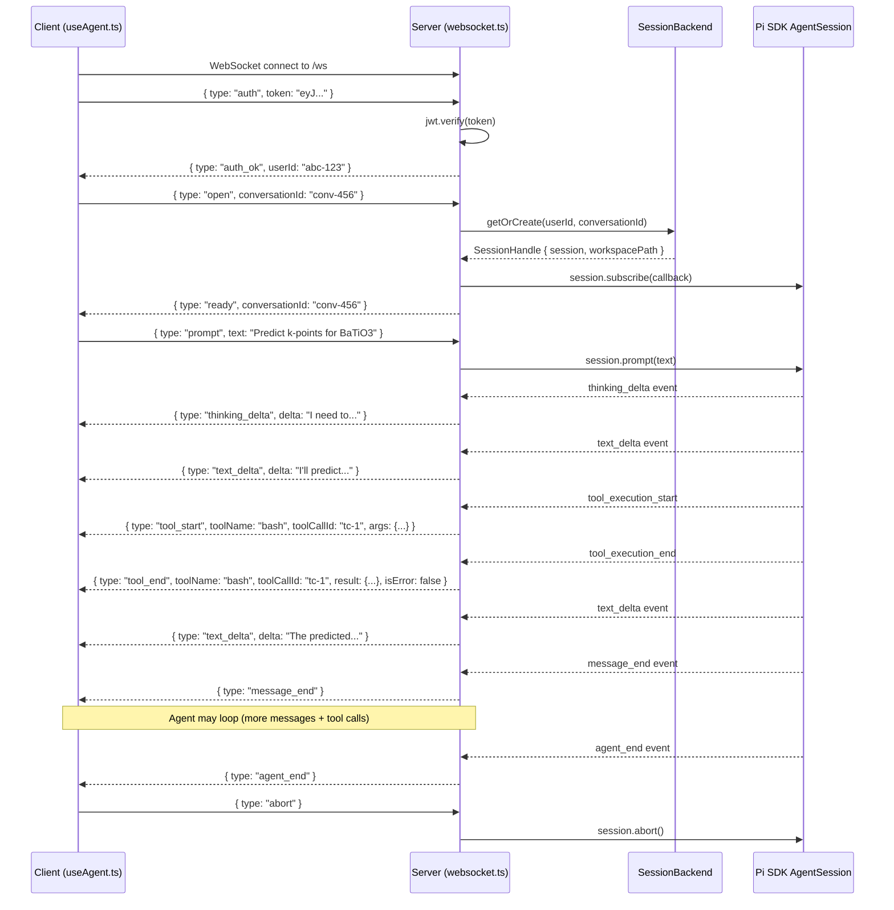

# Goldilocks API Reference

Base URL: `/api`

All endpoints except health check and auth (login/register) require a valid JWT
token in the `Authorization: Bearer <token>` header.

> **Running the examples:** Start the dev server (`npm run dev`), then run the
> curl commands below. The `$TOKEN` and `$CONV_ID` variables are set by the
> register/create steps — run them in order in the same shell session.

---

## Health

### `GET /api/health`

No authentication required.

```bash
curl -s http://localhost:3000/api/health | jq
```

```json
{ "status": "ok", "timestamp": 1711929600000, "version": "0.1.0" }
```

---

## Auth

### `POST /api/auth/register`

| Field | Type | Required | Description |
|-------|------|----------|-------------|
| `email` | string | Yes | Unique email |
| `password` | string | Yes | Min 8 characters |
| `displayName` | string | No | Display name |

```bash
TOKEN=$(curl -s -X POST http://localhost:3000/api/auth/register \
  -H 'Content-Type: application/json' \
  -d '{"email":"dev@example.com","password":"testpass123","displayName":"Dev"}' \
  | jq -r '.token')
echo "TOKEN=$TOKEN"
```

**Response** `201`: `{ token, user: { id, email, displayName } }`

**Errors:** `400` (missing fields, short password), `409` (email exists)

### `POST /api/auth/login`

```bash
TOKEN=$(curl -s -X POST http://localhost:3000/api/auth/login \
  -H 'Content-Type: application/json' \
  -d '{"email":"dev@example.com","password":"testpass123"}' \
  | jq -r '.token')
```

**Response** `200`: `{ token, user: { id, email, displayName, settings } }`

**Errors:** `400` (missing fields), `401` (invalid credentials)

### `POST /api/auth/refresh`

```bash
TOKEN=$(curl -s -X POST http://localhost:3000/api/auth/refresh \
  -H "Authorization: Bearer $TOKEN" | jq -r '.token')
```

### `GET /api/auth/me`

```bash
curl -s http://localhost:3000/api/auth/me -H "Authorization: Bearer $TOKEN" | jq
```

**Response** `200`: `{ user: { id, email, displayName, settings, createdAt } }`

---

## Conversations

### `POST /api/conversations`

```bash
CONV_ID=$(curl -s -X POST http://localhost:3000/api/conversations \
  -H "Authorization: Bearer $TOKEN" \
  -H 'Content-Type: application/json' \
  -d '{"title":"BaTiO3 calculation"}' \
  | jq -r '.conversation.id')
echo "CONV_ID=$CONV_ID"
```

**Response** `201`: `{ conversation: { id, title, model, provider, createdAt, updatedAt } }`

### `GET /api/conversations`

```bash
curl -s http://localhost:3000/api/conversations \
  -H "Authorization: Bearer $TOKEN" | jq '.conversations[].title'
```

**Response** `200`: `{ conversations: [...] }` — ordered by most recently updated.

### `GET /api/conversations/:id`

```bash
curl -s http://localhost:3000/api/conversations/$CONV_ID \
  -H "Authorization: Bearer $TOKEN" | jq
```

### `PATCH /api/conversations/:id`

```bash
curl -s -X PATCH http://localhost:3000/api/conversations/$CONV_ID \
  -H "Authorization: Bearer $TOKEN" \
  -H 'Content-Type: application/json' \
  -d '{"title":"Updated title","model":"claude-sonnet-4-20250514"}' | jq
```

### `DELETE /api/conversations/:id`

```bash
curl -s -X DELETE http://localhost:3000/api/conversations/$CONV_ID \
  -H "Authorization: Bearer $TOKEN" | jq
```

**Response** `200`: `{ ok: true }`

---

## Files

File endpoints are scoped to a conversation's workspace directory
(`WORKSPACE_ROOT/<userId>/<conversationId>/workspace/`).

### `POST /api/conversations/:id/upload`

Files are uploaded as **JSON with base64-encoded content** (not multipart).

| Field | Type | Required | Description |
|-------|------|----------|-------------|
| `filename` | string | Yes | Sanitized on server |
| `content` | string | Yes | Base64-encoded file bytes |

**Allowed extensions:** `.cif`, `.poscar`, `.vasp`, `.xyz`, `.pdb`, `.json`, `.txt`, `.in`, `.out`
**Max size:** 10 MB

```bash
CIF_B64=$(base64 -w0 < BaTiO3.cif)
curl -s -X POST http://localhost:3000/api/conversations/$CONV_ID/upload \
  -H "Authorization: Bearer $TOKEN" \
  -H 'Content-Type: application/json' \
  -d "{\"filename\":\"BaTiO3.cif\",\"content\":\"$CIF_B64\"}" | jq
```

**Response** `201`: `{ file: { name, path, size } }`

**Errors:** `400` (bad extension, invalid base64, too large), `403` (path traversal)

### `GET /api/conversations/:id/files`

```bash
curl -s http://localhost:3000/api/conversations/$CONV_ID/files \
  -H "Authorization: Bearer $TOKEN" | jq
```

**Response** `200`: `{ files: [{ name, size, isDirectory, modified }] }`

Hidden files, `AGENTS.md`, and the `goldilocks` symlink are excluded.

### `GET /api/conversations/:id/files/:filename`

Downloads raw file with appropriate `Content-Type` (`chemical/x-cif`, etc.).

```bash
curl -s http://localhost:3000/api/conversations/$CONV_ID/files/BaTiO3.cif \
  -H "Authorization: Bearer $TOKEN" -o BaTiO3.cif
```

### `GET /api/conversations/:id/files/:filename/content`

Returns UTF-8 text content (for UI display).

```bash
curl -s http://localhost:3000/api/conversations/$CONV_ID/files/BaTiO3.cif/content \
  -H "Authorization: Bearer $TOKEN" | jq '.content'
```

### `DELETE /api/conversations/:id/files/:filename`

```bash
curl -s -X DELETE http://localhost:3000/api/conversations/$CONV_ID/files/BaTiO3.cif \
  -H "Authorization: Bearer $TOKEN" | jq
```

---

## Settings

### `GET /api/settings`

```bash
curl -s http://localhost:3000/api/settings -H "Authorization: Bearer $TOKEN" | jq
```

### `PATCH /api/settings`

Merges keys into existing settings object.

```bash
curl -s -X PATCH http://localhost:3000/api/settings \
  -H "Authorization: Bearer $TOKEN" \
  -H 'Content-Type: application/json' \
  -d '{"defaultFunctional":"PBE"}' | jq
```

### `GET /api/settings/api-keys`

Lists provider key metadata. **Does not return actual keys.**

```bash
curl -s http://localhost:3000/api/settings/api-keys \
  -H "Authorization: Bearer $TOKEN" | jq
```

```json
{
  "apiKeys": [
    { "provider": "anthropic", "hasKey": true, "isServerKey": true, "createdAt": null },
    { "provider": "openai", "hasKey": false, "isServerKey": false, "createdAt": null },
    { "provider": "google", "hasKey": false, "isServerKey": false, "createdAt": null }
  ]
}
```

### `PUT /api/settings/api-key`

Stores key encrypted with AES-256-GCM.

```bash
curl -s -X PUT http://localhost:3000/api/settings/api-key \
  -H "Authorization: Bearer $TOKEN" \
  -H 'Content-Type: application/json' \
  -d '{"provider":"anthropic","key":"sk-ant-..."}' | jq
```

### `DELETE /api/settings/api-key/:provider`

```bash
curl -s -X DELETE http://localhost:3000/api/settings/api-key/anthropic \
  -H "Authorization: Bearer $TOKEN" | jq
```

---

## Structures

### `POST /api/structures/search`

Calls the `goldilocks` CLI under the hood. Timeout: 30s.

```bash
curl -s -X POST http://localhost:3000/api/structures/search \
  -H "Authorization: Bearer $TOKEN" \
  -H 'Content-Type: application/json' \
  -d '{"formula":"BaTiO3","database":"jarvis","limit":3}' | jq
```

**Response** `200`: `{ results: [{ id, formula, spacegroup, natoms, source }] }`

Databases: `jarvis` (default), `mp`, `mc3d`, `oqmd`

### `POST /api/structures/fetch`

Fetches a structure and saves it to a conversation workspace.

```bash
curl -s -X POST http://localhost:3000/api/structures/fetch \
  -H "Authorization: Bearer $TOKEN" \
  -H 'Content-Type: application/json' \
  -d "{\"database\":\"jarvis\",\"id\":\"JVASP-1234\",\"conversationId\":\"$CONV_ID\"}" | jq
```

**Response** `200`: `{ path, structure }`

---

## Structure Library

### `GET /api/library`

```bash
curl -s http://localhost:3000/api/library -H "Authorization: Bearer $TOKEN" | jq
```

### `POST /api/library`

```bash
curl -s -X POST http://localhost:3000/api/library \
  -H "Authorization: Bearer $TOKEN" \
  -H 'Content-Type: application/json' \
  -d "{\"name\":\"BaTiO3 (Pm-3m)\",\"formula\":\"BaTiO3\",\"filePath\":\"BaTiO3.cif\",\"conversationId\":\"$CONV_ID\",\"source\":\"jarvis\"}" | jq
```

### `DELETE /api/library/:id`

```bash
curl -s -X DELETE http://localhost:3000/api/library/$LIB_ID \
  -H "Authorization: Bearer $TOKEN" | jq
```

---

## Quick Generate

Deterministic endpoints — call the `goldilocks` CLI directly, no agent involved.
Timeout: 60s.

### `POST /api/predict`

```bash
curl -s -X POST http://localhost:3000/api/predict \
  -H "Authorization: Bearer $TOKEN" \
  -H 'Content-Type: application/json' \
  -d "{\"structurePath\":\"BaTiO3.cif\",\"conversationId\":\"$CONV_ID\",\"model\":\"ALIGNN\",\"confidence\":0.95}" | jq
```

```json
{
  "prediction": {
    "kdist_median": 0.234,
    "kdist_lower": 0.198,
    "kdist_upper": 0.270,
    "k_grid": [6, 6, 6],
    "is_metal": false,
    "model": "ALIGNN",
    "confidence": 0.95
  }
}
```

### `POST /api/generate`

```bash
curl -s -X POST http://localhost:3000/api/generate \
  -H "Authorization: Bearer $TOKEN" \
  -H 'Content-Type: application/json' \
  -d "{\"structurePath\":\"BaTiO3.cif\",\"conversationId\":\"$CONV_ID\",\"functional\":\"PBEsol\"}" | jq
```

**Response** `200`: `{ filename, content, downloadUrl }`

The generated file is saved to the workspace automatically.

---

## Models

### `GET /api/models`

Availability depends on which providers have valid API keys.

```bash
curl -s http://localhost:3000/api/models -H "Authorization: Bearer $TOKEN" | jq
```

```json
{
  "models": [
    {
      "id": "claude-sonnet-4-20250514",
      "provider": "anthropic",
      "name": "Claude Sonnet 4",
      "contextWindow": 200000,
      "supportsThinking": true
    }
  ],
  "providers": ["anthropic"]
}
```

---

## WebSocket Protocol

Endpoint: `ws://localhost:3000/ws` (or `wss://` for HTTPS).

### Full Connection Flow



### Client → Server Messages

| Type | Fields | Description |
|------|--------|-------------|
| `auth` | `token: string` | JWT authentication |
| `open` | `conversationId: string` | Open/resume a conversation session |
| `prompt` | `text: string`, `files?: string[]` | Send a user message |
| `abort` | — | Cancel current agent processing |

### Server → Client Messages

| Type | Fields | Description |
|------|--------|-------------|
| `auth_ok` | `userId: string` | Authentication successful |
| `auth_fail` | `error: string` | Authentication failed |
| `ready` | `conversationId: string` | Session ready for prompts |
| `text_delta` | `delta: string` | Incremental text from assistant |
| `thinking_delta` | `delta: string` | Incremental thinking content |
| `tool_start` | `toolName`, `toolCallId`, `args` | Agent started a tool |
| `tool_update` | `toolCallId`, `content` | Streaming tool output |
| `tool_end` | `toolName`, `toolCallId`, `result`, `isError` | Tool completed |
| `message_end` | — | One LLM turn complete |
| `agent_end` | — | Agent finished all turns |
| `error` | `error: string` | Error occurred |

### Concurrency Rules

- One prompt at a time per WebSocket connection (enforced by `isProcessing` flag)
- Opening a new conversation cleanly tears down the previous session subscription
- Sessions are cached server-side with LRU eviction; idle sessions evicted after `SESSION_IDLE_TIMEOUT_MS` (default: 5 min)

### Type Definitions

Both client and server import types from `shared/types.ts`:

```ts
import type { ClientMessage, ServerMessage } from '../../../shared/types';
```
