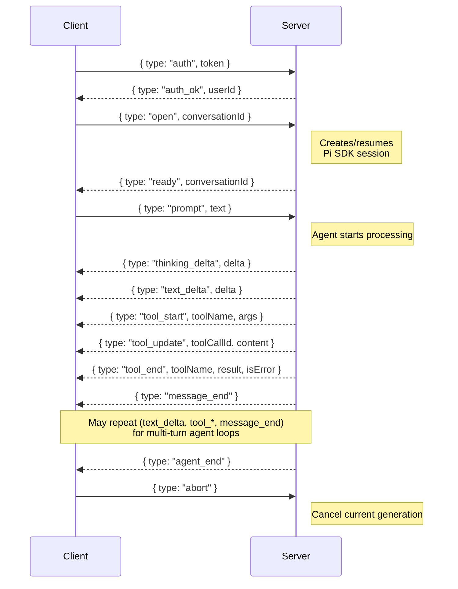

# Goldilocks API Reference

Base URL: `/api`

All endpoints except health check and auth (login/register) require a valid JWT token in the `Authorization: Bearer <token>` header.

---

## Health

### `GET /api/health`

Server health check. No authentication required.

**Response:**

```json
{
  "status": "ok",
  "timestamp": 1711929600000,
  "version": "0.1.0"
}
```

**Example:**

```bash
curl http://localhost:3000/api/health
```

---

## Auth

### `POST /api/auth/register`

Create a new user account.

| Field | Type | Required | Description |
|-------|------|----------|-------------|
| `email` | string | Yes | User email (must be unique) |
| `password` | string | Yes | Password (min 8 characters) |
| `displayName` | string | No | Display name |

**Response** `201`:

```json
{
  "token": "eyJhbGciOiJIUzI1NiIs...",
  "user": {
    "id": "550e8400-e29b-41d4-a716-446655440000",
    "email": "user@example.com",
    "displayName": "Jane Doe"
  }
}
```

**Errors:** `400` (missing fields, short password), `409` (email exists)

**Example:**

```bash
curl -X POST http://localhost:3000/api/auth/register \
  -H 'Content-Type: application/json' \
  -d '{"email":"user@example.com","password":"securepass","displayName":"Jane"}'
```

### `POST /api/auth/login`

Authenticate and receive a JWT token.

| Field | Type | Required | Description |
|-------|------|----------|-------------|
| `email` | string | Yes | User email |
| `password` | string | Yes | User password |

**Response** `200`:

```json
{
  "token": "eyJhbGciOiJIUzI1NiIs...",
  "user": {
    "id": "550e8400-e29b-41d4-a716-446655440000",
    "email": "user@example.com",
    "displayName": "Jane Doe",
    "settings": {}
  }
}
```

**Errors:** `400` (missing fields), `401` (invalid credentials)

**Example:**

```bash
curl -X POST http://localhost:3000/api/auth/login \
  -H 'Content-Type: application/json' \
  -d '{"email":"user@example.com","password":"securepass"}'
```

### `POST /api/auth/refresh`

Refresh an existing JWT token. **Auth required.**

**Response** `200`:

```json
{ "token": "eyJhbGciOiJIUzI1NiIs..." }
```

**Example:**

```bash
curl -X POST http://localhost:3000/api/auth/refresh \
  -H "Authorization: Bearer $TOKEN"
```

### `GET /api/auth/me`

Get the authenticated user's profile. **Auth required.**

**Response** `200`:

```json
{
  "user": {
    "id": "550e8400-...",
    "email": "user@example.com",
    "displayName": "Jane Doe",
    "settings": {},
    "createdAt": 1711929600000
  }
}
```

**Example:**

```bash
curl http://localhost:3000/api/auth/me \
  -H "Authorization: Bearer $TOKEN"
```

---

## Conversations

All conversation endpoints require authentication.

### `GET /api/conversations`

List all conversations for the authenticated user, ordered by most recently updated.

**Response** `200`:

```json
{
  "conversations": [
    {
      "id": "conv-uuid",
      "title": "BaTiO3 calculation",
      "model": "claude-sonnet-4-20250514",
      "provider": "anthropic",
      "created_at": 1711929600000,
      "updated_at": 1711930000000
    }
  ]
}
```

### `POST /api/conversations`

Create a new conversation.

| Field | Type | Required | Description |
|-------|------|----------|-------------|
| `title` | string | No | Conversation title (default: "New conversation") |
| `model` | string | No | LLM model ID |
| `provider` | string | No | LLM provider name |

**Response** `201`:

```json
{
  "conversation": {
    "id": "new-conv-uuid",
    "title": "New conversation",
    "model": null,
    "provider": null,
    "createdAt": 1711929600000,
    "updatedAt": 1711929600000
  }
}
```

### `GET /api/conversations/:id`

Get a single conversation by ID.

**Response** `200`: Same shape as the object in the list response.

**Errors:** `404` (not found or not owned by user)

### `PATCH /api/conversations/:id`

Update a conversation's title, model, or provider.

| Field | Type | Required | Description |
|-------|------|----------|-------------|
| `title` | string | No | New title |
| `model` | string | No | New model ID |
| `provider` | string | No | New provider |

**Response** `200`: Updated conversation object.

### `DELETE /api/conversations/:id`

Delete a conversation.

**Response** `200`:

```json
{ "ok": true }
```

**Example:**

```bash
# Create
curl -X POST http://localhost:3000/api/conversations \
  -H "Authorization: Bearer $TOKEN" \
  -H 'Content-Type: application/json' \
  -d '{"title":"My calculation"}'

# List
curl http://localhost:3000/api/conversations \
  -H "Authorization: Bearer $TOKEN"

# Delete
curl -X DELETE http://localhost:3000/api/conversations/$CONV_ID \
  -H "Authorization: Bearer $TOKEN"
```

---

## Files

File endpoints are nested under conversations. Each conversation has an isolated workspace directory.

### `GET /api/conversations/:conversationId/files`

List files in the conversation workspace.

**Response** `200`:

```json
{
  "files": [
    {
      "name": "BaTiO3.cif",
      "size": 2048,
      "isDirectory": false,
      "modified": 1711929600000
    }
  ]
}
```

Hidden files (starting with `.`), `AGENTS.md`, and the `goldilocks` symlink are excluded.

### `POST /api/conversations/:conversationId/upload`

Upload a file to the workspace. Files are sent as JSON with base64-encoded content (not multipart/form-data).

| Field | Type | Required | Description |
|-------|------|----------|-------------|
| `filename` | string | Yes | File name (sanitized on server) |
| `content` | string | Yes | Base64-encoded file content |

**Allowed extensions:** `.cif`, `.poscar`, `.vasp`, `.xyz`, `.pdb`, `.json`, `.txt`, `.in`, `.out`

**Max file size:** 10 MB

**Response** `201`:

```json
{
  "file": {
    "name": "BaTiO3.cif",
    "path": "BaTiO3.cif",
    "size": 2048
  }
}
```

**Errors:** `400` (bad extension, invalid base64, too large), `403` (path traversal)

**Example:**

```bash
# Upload a CIF file
CIF_B64=$(base64 -w0 < BaTiO3.cif)
curl -X POST http://localhost:3000/api/conversations/$CONV_ID/upload \
  -H "Authorization: Bearer $TOKEN" \
  -H 'Content-Type: application/json' \
  -d "{\"filename\":\"BaTiO3.cif\",\"content\":\"$CIF_B64\"}"
```

### `GET /api/conversations/:conversationId/files/:filename`

Download a file from the workspace. Returns the raw file content with an appropriate `Content-Type` header.

Supported content types: `chemical/x-cif`, `chemical/x-vasp`, `chemical/x-xyz`, `chemical/x-pdb`, `application/json`, `text/plain`, `application/octet-stream`.

### `GET /api/conversations/:conversationId/files/:filename/content`

Read file content as UTF-8 text (useful for displaying in the UI).

**Response** `200`:

```json
{
  "filename": "BaTiO3.cif",
  "content": "data_BaTiO3\n_cell_length_a 4.0..."
}
```

### `DELETE /api/conversations/:conversationId/files/:filename`

Delete a file from the workspace.

**Response** `200`:

```json
{ "ok": true }
```

---

## Settings

### `GET /api/settings`

Get the authenticated user's settings (stored as JSON in the `users.settings` column).

**Response** `200`:

```json
{
  "settings": {
    "defaultModel": "claude-sonnet-4-20250514",
    "defaultFunctional": "PBEsol"
  }
}
```

### `PATCH /api/settings`

Merge updates into the user's settings object.

**Request body:** Any JSON object. Keys are merged with existing settings.

```json
{ "defaultFunctional": "PBE" }
```

**Response** `200`:

```json
{ "settings": { "defaultModel": "claude-sonnet-4-20250514", "defaultFunctional": "PBE" } }
```

### `GET /api/settings/api-keys`

List API key metadata for all supported providers. Returns whether each provider has a key configured and whether it's a server-provided key. **Does not return actual keys.**

**Response** `200`:

```json
{
  "apiKeys": [
    { "provider": "anthropic", "hasKey": true, "isServerKey": true, "createdAt": null },
    { "provider": "openai", "hasKey": false, "isServerKey": false, "createdAt": null },
    { "provider": "google", "hasKey": true, "isServerKey": false, "createdAt": 1711929600000 }
  ]
}
```

### `PUT /api/settings/api-key`

Store an encrypted API key for a provider. Overwrites any existing key for that provider.

| Field | Type | Required | Description |
|-------|------|----------|-------------|
| `provider` | string | Yes | `anthropic`, `openai`, or `google` |
| `key` | string | Yes | The API key |

**Response** `200`:

```json
{ "ok": true, "provider": "anthropic", "createdAt": 1711929600000 }
```

The key is encrypted with AES-256-GCM before storage.

### `DELETE /api/settings/api-key/:provider`

Remove the user's API key for a provider.

**Response** `200`:

```json
{ "ok": true }
```

**Errors:** `400` (invalid provider), `404` (no key found)

**Example:**

```bash
# Add an API key
curl -X PUT http://localhost:3000/api/settings/api-key \
  -H "Authorization: Bearer $TOKEN" \
  -H 'Content-Type: application/json' \
  -d '{"provider":"anthropic","key":"sk-ant-..."}'

# List key metadata
curl http://localhost:3000/api/settings/api-keys \
  -H "Authorization: Bearer $TOKEN"

# Remove a key
curl -X DELETE http://localhost:3000/api/settings/api-key/anthropic \
  -H "Authorization: Bearer $TOKEN"
```

---

## Structures

### `POST /api/structures/search`

Search crystal structure databases by chemical formula.

| Field | Type | Required | Description |
|-------|------|----------|-------------|
| `formula` | string | Yes | Chemical formula (e.g., `BaTiO3`, `Si`) |
| `database` | string | No | Database to search: `jarvis` (default), `mp`, `mc3d`, `oqmd` |
| `limit` | number | No | Max results (default: 10) |

**Response** `200`:

```json
{
  "results": [
    {
      "id": "JVASP-1234",
      "formula": "BaTiO3",
      "spacegroup": "Pm-3m",
      "natoms": 5,
      "source": "jarvis"
    }
  ]
}
```

Calls the `goldilocks` CLI tool under the hood. Timeout: 30 seconds.

### `POST /api/structures/fetch`

Fetch a structure from a database and save it to a conversation's workspace.

| Field | Type | Required | Description |
|-------|------|----------|-------------|
| `database` | string | Yes | Source database |
| `id` | string | Yes | Structure ID from search results |
| `conversationId` | string | Yes | Target conversation workspace |

**Response** `200`:

```json
{
  "path": "BaTiO3_JVASP-1234.cif",
  "structure": { ... }
}
```

---

## Structure Library

User's personal collection of saved crystal structures.

### `GET /api/library`

List all saved structures for the authenticated user.

**Response** `200`:

```json
{
  "structures": [
    {
      "id": "lib-uuid",
      "name": "BaTiO3 (Pm-3m)",
      "formula": "BaTiO3",
      "source": "jarvis",
      "sourceId": "JVASP-1234",
      "filePath": "/data/workspaces/.../BaTiO3.cif",
      "metadata": {},
      "createdAt": 1711929600000
    }
  ]
}
```

### `POST /api/library`

Save a structure to the user's library.

| Field | Type | Required | Description |
|-------|------|----------|-------------|
| `name` | string | Yes | Display name |
| `formula` | string | Yes | Chemical formula |
| `filePath` | string | Yes | Path to the structure file |
| `conversationId` | string | No | If provided, path is resolved relative to the conversation workspace |
| `source` | string | No | Source database |
| `sourceId` | string | No | Source database ID |
| `metadata` | object | No | Arbitrary metadata |

**Response** `201`: Created structure object.

### `DELETE /api/library/:id`

Remove a structure from the library.

**Response** `200`:

```json
{ "ok": true }
```

---

## Quick Generate

Deterministic endpoints that call the `goldilocks` CLI directly without involving the AI agent. Useful for the "Quick Generate" button in the Parameters panel.

### `POST /api/predict`

Predict optimal k-point spacing for a crystal structure.

| Field | Type | Required | Description |
|-------|------|----------|-------------|
| `structurePath` | string | Yes | Path to structure file (relative to workspace) |
| `conversationId` | string | Yes | Conversation whose workspace contains the file |
| `model` | string | No | ML model: `ALIGNN` or `RF` |
| `confidence` | number | No | Confidence level: `0.95`, `0.90`, or `0.85` |

**Response** `200`:

```json
{
  "prediction": {
    "kdist_median": 0.234,
    "kdist_lower": 0.198,
    "kdist_upper": 0.270,
    "k_grid": [6, 6, 6],
    "is_metal": false,
    "model": "ALIGNN",
    "confidence": 0.95
  }
}
```

**Errors:** `403` (path traversal), `404` (file not found), `500` (CLI failure)

Timeout: 60 seconds.

### `POST /api/generate`

Generate a Quantum ESPRESSO SCF input file.

| Field | Type | Required | Description |
|-------|------|----------|-------------|
| `structurePath` | string | Yes | Path to structure file (relative to workspace) |
| `conversationId` | string | Yes | Conversation whose workspace contains the file |
| `functional` | string | No | DFT functional: `PBEsol` or `PBE` |
| `pseudoMode` | string | No | Pseudopotential mode: `efficiency` or `precision` |

**Response** `200`:

```json
{
  "filename": "scf_BaTiO3.in",
  "content": "&CONTROL\n  calculation = 'scf'\n  ...",
  "downloadUrl": "/api/conversations/conv-id/files/scf_BaTiO3.in"
}
```

The generated file is automatically saved to the workspace.

Timeout: 60 seconds.

**Example:**

```bash
# Predict k-points
curl -X POST http://localhost:3000/api/predict \
  -H "Authorization: Bearer $TOKEN" \
  -H 'Content-Type: application/json' \
  -d '{"structurePath":"BaTiO3.cif","conversationId":"conv-id","model":"ALIGNN"}'

# Generate input file
curl -X POST http://localhost:3000/api/generate \
  -H "Authorization: Bearer $TOKEN" \
  -H 'Content-Type: application/json' \
  -d '{"structurePath":"BaTiO3.cif","conversationId":"conv-id","functional":"PBEsol"}'
```

---

## Models

### `GET /api/models`

List available LLM models. Availability is determined by which providers have valid API keys configured (either server-wide or user-specific).

Uses the Pi SDK's `ModelRegistry.getAvailable()` under the hood.

**Response** `200`:

```json
{
  "models": [
    {
      "id": "claude-sonnet-4-20250514",
      "provider": "anthropic",
      "name": "Claude Sonnet 4",
      "contextWindow": 200000,
      "supportsThinking": true
    }
  ],
  "providers": ["anthropic"]
}
```

**Example:**

```bash
curl http://localhost:3000/api/models \
  -H "Authorization: Bearer $TOKEN"
```

---

## WebSocket Protocol

The WebSocket endpoint is at `ws://localhost:3000/ws` (or `wss://` for HTTPS).

### Connection Flow



### Client → Server Messages

| Type | Fields | Description |
|------|--------|-------------|
| `auth` | `token: string` | JWT authentication |
| `open` | `conversationId: string` | Open/resume a conversation session |
| `prompt` | `text: string`, `files?: string[]` | Send a user message |
| `abort` | — | Cancel current agent processing |

### Server → Client Messages

| Type | Fields | Description |
|------|--------|-------------|
| `auth_ok` | `userId: string` | Authentication successful |
| `auth_fail` | `error: string` | Authentication failed |
| `ready` | `conversationId: string` | Session ready for prompts |
| `text_delta` | `delta: string` | Incremental text from the assistant |
| `thinking_delta` | `delta: string` | Incremental thinking/reasoning content |
| `tool_start` | `toolName`, `toolCallId`, `args` | Agent started executing a tool |
| `tool_update` | `toolCallId`, `content` | Streaming output from a tool |
| `tool_end` | `toolName`, `toolCallId`, `result`, `isError` | Tool execution completed |
| `message_end` | — | One LLM message turn is complete |
| `agent_end` | — | Agent has finished all turns |
| `error` | `error: string` | Error occurred |

### Notes

- The client must authenticate before opening a session.
- Only one prompt can be in-flight at a time. Sending a second prompt while one is processing returns an error.
- Sessions are cached server-side with LRU eviction. Idle sessions are evicted after `SESSION_IDLE_TIMEOUT_MS` (default: 5 minutes).
- Opening a new conversation on the same WebSocket connection cleanly tears down the previous session.
