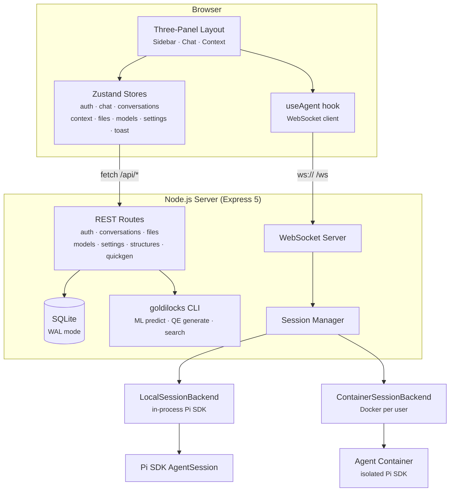
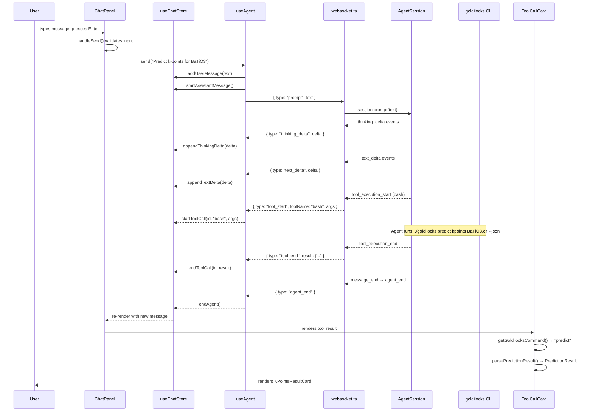

# Architecture

This document covers the high-level architecture. For focused deep-dives, see:

- [Data Flow](architecture/data-flow.md) — what happens when a user sends a message
- [Frontend](architecture/frontend.md) — component tree, state management, hooks
- [Backend](architecture/backend.md) — Express routes, middleware, database
- [WebSocket & Sessions](architecture/websocket-sessions.md) — real-time protocol, session backends
- [Security](architecture/security.md) — auth, sandboxing, path traversal, limitations
- [Deployment](architecture/deployment.md) — Docker, Kubernetes, container images

## System Overview

## The Request Path (End to End)

Here's exactly what happens when a user types "Predict k-points for BaTiO3"
and hits Enter:

1. `ChatPanel.handleSend()` calls `useAgent.send(text)` which pushes a user message to the store and sends `{ type: "prompt", text }` over the WebSocket.

2. `websocket.ts` receives the message, calls `session.prompt(text)` on the Pi SDK `AgentSession`.

3. Pi SDK streams events back — `text_delta`, `thinking_delta`, `tool_start`/`tool_end`, `message_end`, `agent_end`. The `mapAgentEvent()` function in `websocket.ts` translates Pi SDK event types to our `ServerMessage` union.

4. `useAgent` receives each WebSocket message and dispatches to `useChatStore` actions (`appendTextDelta`, `startToolCall`, `endToolCall`, `endMessage`, `endAgent`).

5. `ChatPanel` re-renders. For tool calls, `ToolCallCard` checks if it's a `bash` call to the `goldilocks` CLI. If `getGoldilocksCommand(args)` returns `"predict"`, it parses the result with `parsePredictionResult()` and renders a `KPointsResultCard`.

6. `endAgent()` finalizes: any buffered text/thinking/tools are flushed into a `ChatMessage`, persisted to `localStorage`, and `isStreaming` is set to `false`.
