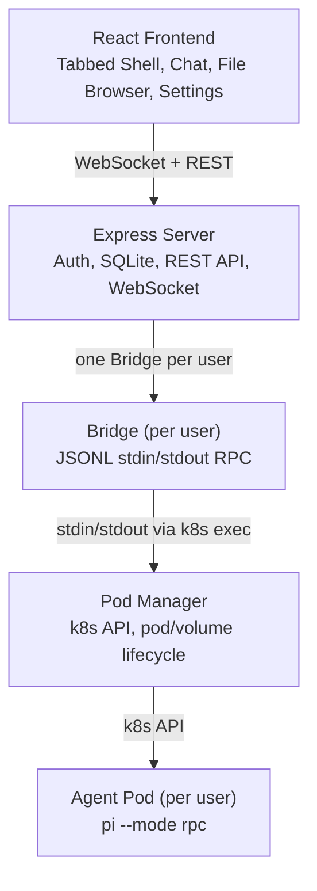
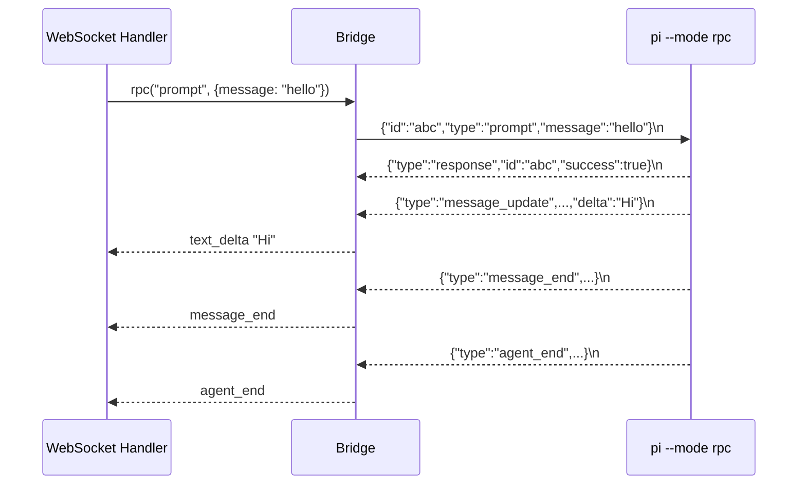
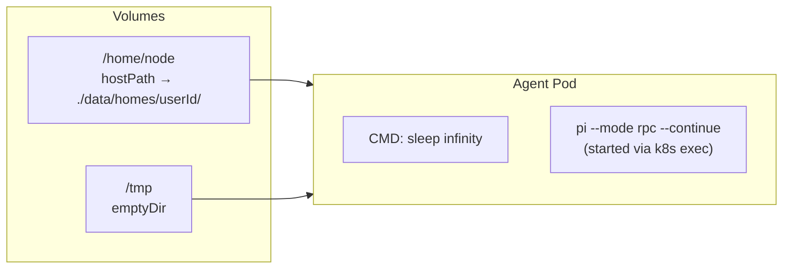

# Architecture

## Overview

Goldilocks is a web application that wraps the [Pi coding agent](https://github.com/mariozechner/pi-coding-agent) with a multi-user UI for DFT calculation assistance. The web app is a thin layer — Pi owns all agent logic, sessions, tools, and model selection.

## Principles

1. **One architecture.** k8s for dev (kind + Tilt) and prod. No local-mode alternative.
2. **Pi owns the agent.** Sessions, conversations, tools, models — all managed by Pi. The web app doesn't reimplement any of it.
3. **Bridge pattern.** Communication with Pi is JSONL over stdin/stdout. The Bridge is the only code that talks to Pi.
4. **Pod per user, not per session.** One long-lived pod per user. Pi switches sessions internally via RPC.
5. **Build bottom-up.** Every layer tested against real infrastructure before the next layer goes on.

## Layers

### Frontend (React)

The browser-side application. Connects to the server via WebSocket for streaming chat and REST for metadata (conversations, files, models, settings).

**Owns:** UI rendering, local UI state (which tab is active, textarea content, sidebar mode).

**Does not own:** Message history (server-side in Pi), session state, file storage, model selection logic.

### Express Server

The HTTP/WebSocket server. Handles auth (JWT), serves the REST API, and bridges WebSocket connections to per-user Bridge instances.

**Owns:** Authentication, conversation metadata (SQLite), file proxy, WebSocket fan-out, Bridge lifecycle.

**Does not own:** Agent logic, conversation content, model selection logic.

### Bridge

One instance per user. Communicates with Pi via JSONL over stdin/stdout streams. Handles RPC request/response correlation, event dispatch to subscribers, and structured logging.

**Owns:** JSONL protocol, RPC correlation with timeouts, event parsing, text delta accumulation, `message_end` fallback text extraction, tool call streaming, file logging.

**Does not own:** k8s, HTTP, WebSocket, auth.

**Key file:** `server/src/agent/bridge.ts`

### Pod Manager

Manages k8s resources. Creates pods and hostPath volumes per user, execs commands into pods, handles idle timeouts and failure backoff.

**Owns:** k8s API calls, pod creation/deletion, hostPath volume provisioning, exec streams, idle timeout eviction, backoff on failures.

**Does not own:** Pi, RPC protocol, conversations.

**Key file:** `server/src/agent/pod-manager.ts`

### Agent Pod

A container running Pi. One per user, long-lived. The pod runs `sleep infinity` and Pi is started via k8s exec (`pi --mode rpc --continue`). The user's home directory is a hostPath volume that persists across pod restarts and cluster rebuilds.

**Owns:** Running Pi, user's home directory, all Pi state.

## Data Ownership

| Data | Where | Why |
|------|-------|-----|
| Users, auth | SQLite | Web app owns auth |
| Encrypted API keys | SQLite | Decrypted and passed as env vars on pod creation |
| Conversation metadata | SQLite | Sidebar needs titles/timestamps without hitting the pod |
| Conversation content | Pi session files on hostPath (`~/.pi/`) | Pi owns this |
| User files | hostPath (`~/`) | Pi's working directory |
| Available models | Pi (via `get_available_models` RPC) | Pi knows which keys are set |

## Detailed Documentation

- **[Backend](architecture/backend.md)** — Server modules, Bridge, Pod Manager, REST API
- **[Frontend](architecture/frontend.md)** — React components, Zustand stores, routing
- **[Data Flow](architecture/data-flow.md)** — Prompt flow, model selection, file upload, conversation lifecycle
- **[Deployment](architecture/deployment.md)** — Kind + Tilt setup, k8s resources, production notes
- **[Security](architecture/security.md)** — Auth, API key encryption, container isolation, network
- **[WebSocket Sessions](architecture/websocket-sessions.md)** — Connection model, idle timeout, failure handling, multi-tab
