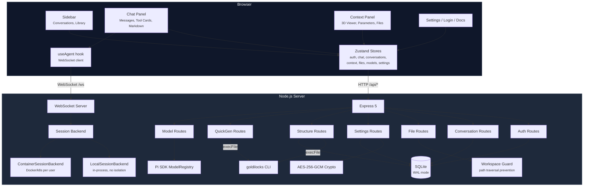
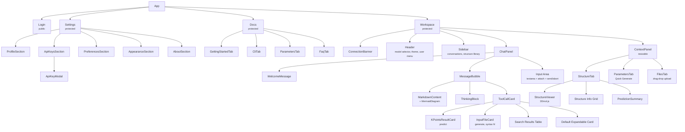
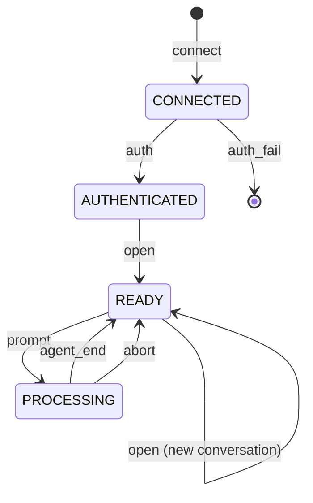
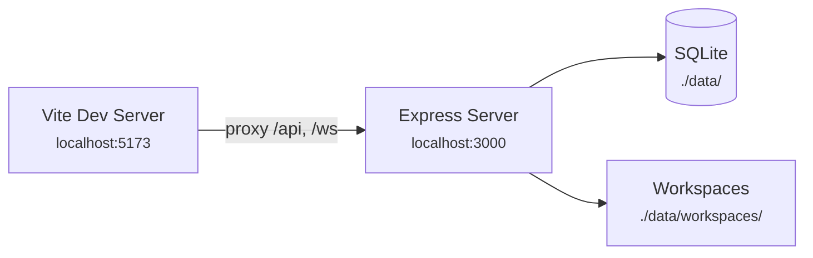
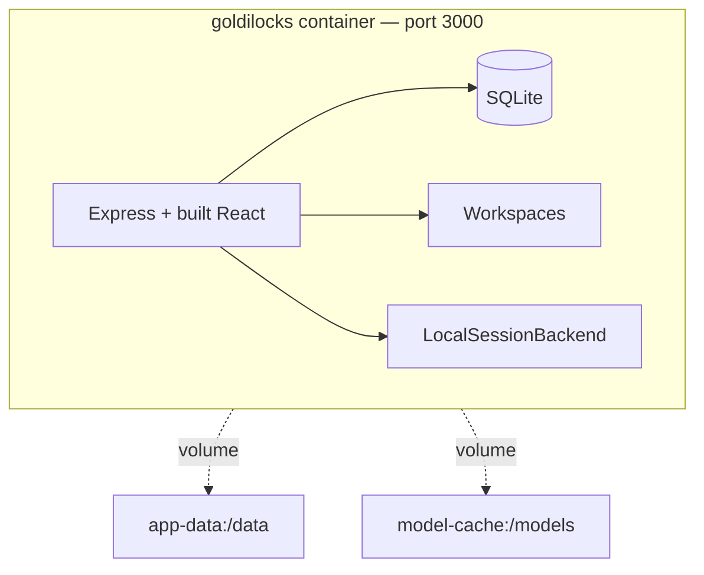
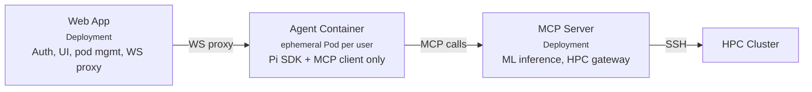

# Goldilocks Architecture

## High-Level System Diagram



## Frontend Architecture

### Component Hierarchy



### Zustand Stores

| Store | Persistence | Purpose |
|-------|-------------|---------|
| `auth` | `localStorage` (token only) | User session, login/register/logout |
| `chat` | `localStorage` (message history) | Messages, streaming state, tool calls. Keyed by conversation ID. |
| `conversations` | None (fetched from API) | Conversation list, active selection |
| `context` | None | Current structure info, DFT parameters, last prediction |
| `files` | None (fetched from API) | Workspace file list |
| `models` | None (fetched from API) | Available LLM models, selected model |
| `settings` | `localStorage` (theme only) | Theme, API key metadata, user preferences |
| `toast` | None | Notification queue (max 3, auto-dismiss 5s) |

### Data Flow

1. **Authentication**: `LoginForm` → `useAuthStore.login()` → `POST /api/auth/login` → token stored in localStorage. All subsequent API calls include the token via `api/client.ts`.

2. **Chat messages**: `useAgent` hook opens a WebSocket, authenticates, and opens a conversation session. User messages go through the WebSocket as `prompt` messages. Server events (`text_delta`, `tool_start`, etc.) are dispatched to `useChatStore` actions. Messages are persisted to localStorage keyed by conversation ID.

3. **File operations**: `useFilesStore` calls REST endpoints. Uploads read the file as base64 via FileReader, POST as JSON. The ContextPanel's FilesTab and ChatPanel's file attach button both trigger uploads.

4. **Tool result cards**: When a tool call completes, `ChatPanel` checks if it's a `bash` call to the `goldilocks` CLI. If so, it parses the result and renders a specialized card (KPointsResultCard, InputFileCard, or a search results table). Otherwise, it renders a generic expandable card with JSON args and result.

5. **Quick Generate**: The ParametersTab calls `/api/predict` and `/api/generate` directly (REST, no agent). These endpoints invoke the `goldilocks` CLI and return results synchronously.

### Hooks

| Hook | Purpose |
|------|---------|
| `useAgent(conversationId)` | Manages the WebSocket lifecycle. Returns `send`, `abort`, `isConnected`, `isReady`, `error`. Reconnects when conversation changes. |
| `useConnectionStatus()` | Polls `/api/health` every 30s. Exponential backoff on failure. Listens for browser online/offline events. Powers the `ConnectionBanner`. |

## Backend Architecture

### Express Routes

| Mount Point | Router | Auth | Purpose |
|-------------|--------|------|---------|
| `GET /api/health` | Inline | No | Health check |
| `/api/auth` | `auth/routes.ts` | Varies | Register, login, refresh, me |
| `/api/conversations` | `conversations/routes.ts` | Yes | CRUD for conversations |
| `/api/conversations/:id/...` | `files/routes.ts` | Yes | File upload, download, list, delete |
| `/api/models` | `models/routes.ts` | Yes | Available LLM models |
| `/api/settings` | `settings/routes.ts` | Yes | User settings + encrypted API keys |
| `/api/structures` | `structures/routes.ts` | Yes | Structure search + fetch |
| `/api/library` | `structures/routes.ts` (libraryRouter) | Yes | Structure library CRUD |
| `/api/predict` | `quickgen/routes.ts` | Yes | K-point prediction (CLI) |
| `/api/generate` | `quickgen/routes.ts` | Yes | QE input generation (CLI) |

### Middleware Stack

1. `cors()` — Permissive CORS (development convenience)
2. `express.json()` — JSON body parsing
3. `verifyToken` — JWT verification (per-router, not global)

### Database

SQLite via `better-sqlite3` with WAL journal mode and foreign keys enabled.

**Tables:**
- `users` — id, email, password_hash, display_name, settings (JSON text), created_at
- `api_keys` — user_id + provider (composite PK), encrypted_key, created_at
- `conversations` — id, user_id, title, model, provider, timestamps
- `structure_library` — id, user_id, name, formula, source, source_id, file_path, metadata (JSON text)
- `migrations` — tracking table for applied migrations

Migrations are `.sql` files in `server/src/migrations/`, applied in alphabetical order on server start.

### Goldilocks CLI Integration

The `structures/routes.ts` and `quickgen/routes.ts` route files invoke the `goldilocks` CLI binary via `child_process.execFile()` with:
- `--json` flag for machine-readable output
- 30s timeout for search/fetch, 60s for predict/generate
- Workspace path as the working directory for generate commands

The CLI binary lives at `bin/goldilocks` and is symlinked into each conversation workspace.

## Session Management

### SessionBackend Interface

```typescript
interface SessionBackend {
  getOrCreate(userId, conversationId): Promise<SessionHandle>;
  touch(userId, conversationId): void;
  dispose(userId, conversationId): void;
  shutdown(): void;
}

interface SessionHandle {
  session: AgentSession;     // Pi SDK session
  workspacePath: string;     // Absolute path to user's workspace
  sessionPath: string;       // Absolute path to Pi session storage
}
```

### LocalSessionBackend

Used in development and single-user deployments (`SESSION_BACKEND=local`, the default).

- Runs Pi SDK `AgentSession` instances directly in the Express process
- LRU cache with configurable `MAX_SESSIONS` (default: 20)
- Idle timeout eviction every 60 seconds (`SESSION_IDLE_TIMEOUT_MS`, default: 5 min)
- Creates an `AGENTS.md` in each workspace with goldilocks CLI instructions
- Symlinks the goldilocks CLI into the workspace

**Lifecycle:**
1. WebSocket `open` message → `sessionCache.getOrCreate(userId, conversationId)`
2. Backend checks cache → hit: return existing session, miss: create new one
3. If at capacity, evict the least-recently-used session
4. Create workspace + session directories
5. Configure `AuthStorage` with server API keys
6. Create `AgentSession` via Pi SDK
7. Return `SessionHandle`

**Warning:** All users share the same OS process. No filesystem or process isolation. A malicious agent prompt could theoretically access other users' data.

### ContainerSessionBackend

Used in production multi-user deployments (`SESSION_BACKEND=container`).

- Spawns a Docker container per user session
- Each container runs a minimal Pi SDK agent image
- Containers are isolated: separate filesystem, process namespace, network
- WebSocket proxy: the web app forwards events between client and container
- Port allocation: ephemeral ports 9000–9999

**Container configuration:**
- `--memory 512m` — Memory limit
- `--cpus 0.5` — CPU limit
- `--read-only` — Read-only root filesystem
- `--tmpfs /tmp:size=256m, /work:size=1g` — Writable temp directories
- `--security-opt no-new-privileges` — Prevent privilege escalation
- `--cap-drop ALL` — Drop all Linux capabilities

**PodReaper:** A periodic cleanup process that finds and terminates orphaned containers (running longer than 4 hours, not tracked by the session backend). Runs every 5 minutes.

## WebSocket Streaming Protocol

### State Machine (per client connection)



### Event Mapping

Pi SDK `AgentSessionEvent` types are mapped to WebSocket messages:

| Pi SDK Event | WebSocket Message |
|-------------|-------------------|
| `message_update` (text_delta) | `text_delta` |
| `message_update` (thinking_delta) | `thinking_delta` |
| `tool_execution_start` | `tool_start` |
| `tool_execution_update` | `tool_update` |
| `tool_execution_end` | `tool_end` |
| `message_end` | `message_end` |
| `agent_end` | `agent_end` |

### Concurrency

- One prompt at a time per WebSocket connection. A second prompt while processing returns an error.
- Opening a new conversation on the same connection cleans up the previous session's subscription.
- The `isProcessing` flag prevents concurrent prompts.

## Deployment Architecture


### Development (Local)



Single process. Vite proxies API and WebSocket requests.

### Docker Compose (Single User)



### Kubernetes (Multi-User Production)



- **Web App** (Deployment): Persistent. Handles auth, serves UI, manages agent pod lifecycle, proxies WebSocket connections.
- **Agent** (ephemeral Pod): One per active session. Contains only Pi SDK + MCP client. Read-only rootfs, no SSH keys, egress restricted to MCP server.
- **MCP Server** (Deployment): Persistent. Hosts ML models, manages HPC job submission via SSH. Only component with HPC access.

### Kubernetes Resources

| Manifest | Purpose |
|----------|---------|
| `namespace.yaml` | `goldilocks` namespace |
| `rbac.yaml` | ServiceAccount for pod creation/deletion |
| `network-policies.yaml` | Restrict agent egress to MCP server only |
| `resource-quota.yaml` | Limit total agent pods per namespace |
| `mcp-server.yaml` | MCP server Deployment + Service |
| `web-app.yaml` | Web app Deployment + Service |
| `ingress.yaml` | Ingress with TLS |
| `secrets.yaml` | Secret templates |
| `agent-pod-template.yaml` | Template for ephemeral agent pods |

## Security Model

### Authentication & Authorization

- **Password hashing**: bcrypt with 12 salt rounds
- **JWT tokens**: Signed with `JWT_SECRET`, 7-day expiry
- **API key encryption**: AES-256-GCM with key derived from `ENCRYPTION_KEY` via SHA-256. Stored as `iv:authTag:ciphertext` (hex)
- **Per-user data isolation**: All database queries filter by `user_id`. File paths are scoped to `WORKSPACE_ROOT/<userId>/<conversationId>/workspace/`

### Path Traversal Prevention

`workspace-guard.ts` validates that resolved file paths stay within the workspace base directory:

```typescript
const resolved = resolve(basePath, requestedPath);
if (!resolved.startsWith(basePath)) {
  throw new Error('Path traversal detected');
}
```

File names are sanitized on upload: `basename(filename).replace(/[^a-zA-Z0-9._-]/g, '_')`.

### Current Limitations

1. **LocalSessionBackend has no sandboxing.** All agent sessions run in the Express process. A prompt injection could potentially access the filesystem, environment variables, or other users' workspaces. This is acceptable for single-user development but not for multi-user production.

2. **Workspace guard is convention-based.** `resolve()` + `startsWith()` catches `../` traversal but doesn't prevent symlink escapes. Real sandboxing requires the ContainerSessionBackend.

3. **No rate limiting.** The API has no rate limiting on auth endpoints or file uploads. Production deployments should add rate limiting via reverse proxy (nginx, Caddy) or middleware.

4. **CORS is permissive.** `cors()` is called with no options (allows all origins). Production should restrict to the app's domain.

5. **User API keys are not yet wired to agent sessions.** The `LocalSessionBackend` uses server-configured keys via `AuthStorage`. Per-user encrypted keys stored in the `api_keys` table are not yet decrypted and injected into individual sessions.

6. **No CSRF protection.** The API relies entirely on Bearer tokens. This is fine for API-only clients but could be a concern if cookies are ever added.

7. **Chat history is client-side only.** Messages are stored in `localStorage`, not synced to the server database. Clearing browser data loses conversation history. The `conversations` table tracks metadata only (title, model, timestamps).
