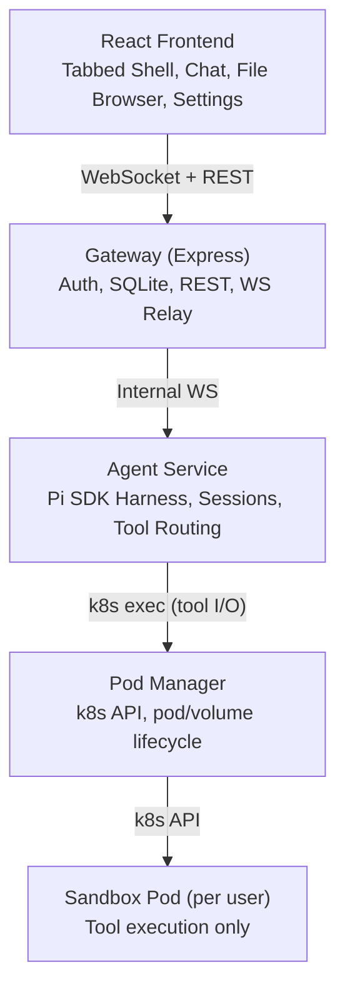
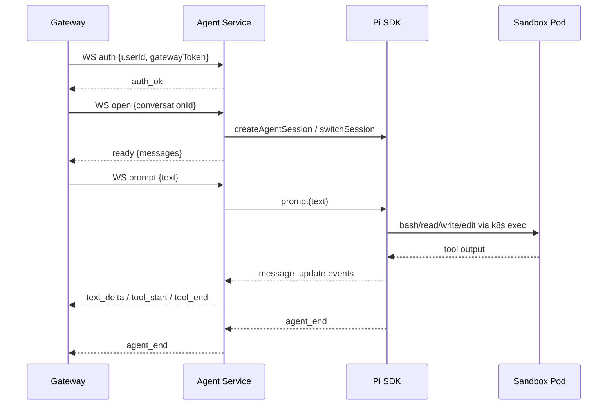
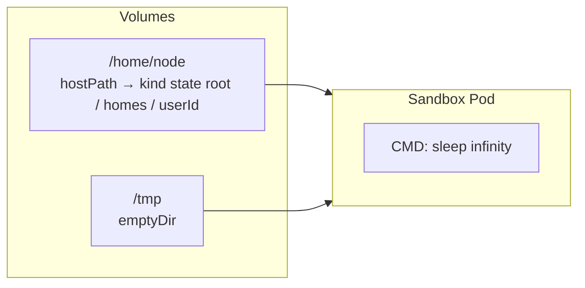

# Architecture

## Overview

Goldilocks is a web application that wraps the [Pi coding agent](https://github.com/mariozechner/pi-coding-agent) with a multi-user UI for DFT calculation assistance. The agent runs in a dedicated service using the Pi SDK in-process, with all tool execution routed through per-user Kubernetes pods.

## Principles

1. **One architecture.** k8s for dev (kind + Tilt) and prod. No local-mode alternative.
2. **Pi owns the agent.** Sessions, conversations, models — managed by Pi's SDK inside the agent-service. The gateway doesn't reimplement any agent logic.
3. **Brain outside the sandbox.** The agent (reasoning, auth, session state) lives in the agent-service. The pod runs only tool commands: bash, read, write, edit, find, grep, ls.
4. **Credentials stay outside the pod.** Provider API keys are never injected into sandbox environment variables. They live only in `AuthStorage` inside the agent-service.
5. **Pod per user, not per session.** One long-lived pod per user. Pi switches sessions via the SDK, not by restarting the process.
6. **Sessions survive harness restarts.** Session files are stored durably outside the pod. If the agent-service restarts, it reopens sessions from disk.

## Layers

### Frontend (React)

The browser-side application. Connects to the gateway via WebSocket for streaming chat and REST for metadata (conversations, files, models, settings).

**Owns:** UI rendering, local UI state (which tab is active, textarea content, sidebar mode).

**Does not own:** Message history (server-side in Pi sessions), session state, file storage, model selection logic.

### Gateway (Express)

The HTTP/WebSocket server. Handles auth (JWT), serves the REST API, and relays WebSocket connections to the agent-service.

**Owns:** Authentication, conversation metadata (SQLite), file proxy, WebSocket relay, static file serving.

**Does not own:** Agent logic, session state, model inference, tool execution.

Key files:
- `apps/gateway/src/agent/websocket.ts` — WS relay: browser auth → internal WS to agent-service
- `apps/gateway/src/agent/agent-service-client.ts` — HTTP proxy to agent-service for REST routes

### Agent Service

A dedicated Node process (port 3001) that runs the Pi SDK. Creates and manages `AgentSession` instances, routes tool execution to per-user pods, and streams events back to the gateway.

**Owns:** Pi SDK sessions, AuthStorage (decrypted provider keys), PodManager, tool routing, model selection, conversation history.

**Does not own:** User auth, conversation metadata DB, static file serving.

Key file: `apps/agent-service/src/index.ts`

### Pod Tool Operations

Rather than the Pi SDK running tools locally, Goldilocks provides pluggable operations backends that execute inside the user's pod via k8s exec:

- `BashOperations.exec()` → `k8s exec` with shell command
- `ReadOperations.readFile()` → `k8s exec cat`
- `WriteOperations.writeFile()` → `k8s exec` with base64 pipe
- `EditOperations.readFile/writeFile()` → same as read/write
- `FindOperations`, `GrepOperations`, `LsOperations` → shell commands in the pod

**Key file:** `packages/runtime/src/pod-tool-operations.ts`

### Pod Manager

Manages k8s resources. Creates pods and hostPath volumes per user, execs commands into pods, handles idle timeouts and failure backoff.

**Owns:** k8s API calls, pod creation/deletion, hostPath volume provisioning, exec streams, idle timeout eviction, backoff on failures.

**Does not own:** Pi sessions, RPC protocol, conversations.

**Key file:** `packages/runtime/src/pod-manager.ts`

### Sandbox Pod

A container running `sleep infinity`. One per user, long-lived. No pi binary, no provider credentials. Tools are executed via k8s exec from the agent-service. The user's home directory is a hostPath volume that persists across pod restarts.

**Owns:** User's home directory, all Pi state (files only — sessions are managed externally).

**Does not own:** Pi process, provider keys, agent logic.

## Data Ownership

| Data | Where | Why |
|------|-------|-----|
| Users, auth, conversation metadata | SQLite (gateway) | Web app owns auth and metadata |
| Provider API keys (encrypted) | SQLite (gateway) | Decrypted only inside agent-service's AuthStorage |
| Conversation content | Pi session files on hostPath | Pi owns this via SessionManager |
| User files | hostPath (`~/`) | Pod's working directory |
| Available models | Pi (via SDK) | Pi knows which provider keys are set |

## Detailed Documentation

- **[Backend](architecture/backend.md)** — Gateway modules, agent-service, pod tool operations, REST API
- **[Frontend](architecture/frontend.md)** — React components, Zustand stores, routing
- **[Data Flow](architecture/data-flow.md)** — Prompt flow, model selection, file upload, conversation lifecycle
- **[Deployment](architecture/deployment.md)** — Kind + Tilt setup, k8s resources, production notes
- **[Security](architecture/security.md)** — Auth, API key handling, container isolation, network
- **[WebSocket Sessions](architecture/websocket-sessions.md)** — Connection model, idle timeout, failure handling, multi-tab