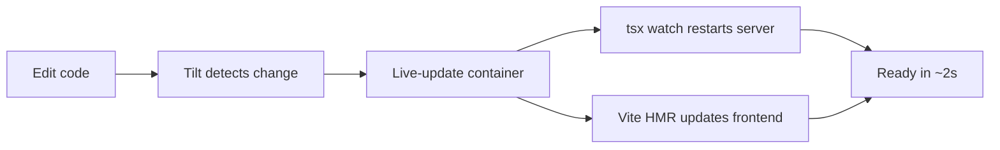

# Development Guide

## Prerequisites

- **Docker** (for building images)
- **kind** (Kubernetes in Docker) — `go install sigs.k8s.io/kind@latest` or via package manager
- **Tilt** — https://docs.tilt.dev/install
- **Node.js 22+**
- **kubectl** — for debugging

### Using Nix

If you have [Nix](https://nixos.org/) with flakes enabled, all dependencies are provided by the dev shell:

```bash
nix develop        # enter the shell (Node.js 22, kind, kubectl, tilt)
```

Or with [direnv](https://direnv.net/), add `use flake` to `.envrc` for automatic activation.

## Quick Start

```bash
# 1. Install npm dependencies
npm install

# 2. Create the kind cluster (idempotent)
npm run dev:setup

# 3. Start Tilt (builds images, deploys, watches for changes)
tilt up

# 4. Open browser
#    Frontend:  http://localhost:5173
#    API:       http://localhost:3000
#    Headlamp:  http://localhost:8080
#    Tilt UI:   http://localhost:10350
```

## Dev Workflow



Tilt watches for file changes and live-syncs them into the running container. The server uses `tsx watch` (auto-restart on change) and the frontend uses Vite HMR (instant updates).

### What triggers what

| Change | What happens |
|--------|-------------|
| `server/src/**/*.ts` | Live-synced → tsx watch restarts |
| `frontend/src/**/*.tsx` | Live-synced → Vite HMR |
| `shared/types.ts` | Live-synced → both restart |
| `package.json` / `package-lock.json` | Full image rebuild |
| `deploy/docker/Dockerfile.agent` | Agent image rebuild + kind load |
| `k8s/*.yaml` | Re-applied to cluster |
| `dashboard/k8s/*.yaml` | Re-applied to cluster |
| `dashboard/scripts/*.sh` | Re-runs dashboard helper resources |

### First-time setup

1. Register a user account at http://localhost:5173 (any email/password)
2. Go to Settings → API Keys → Add your Anthropic key
3. Create a conversation and start chatting

### Resetting

```bash
# Stop Tilt
tilt down

# Delete cluster and all data
npm run dev:reset

# Start fresh
npm run dev:setup
tilt up
```

## Debugging

### Headlamp dashboard

Tilt port-forwards Headlamp to `http://localhost:8080` and generates a dev login token at `.dev/headlamp-token.txt`.

```bash
cat .dev/headlamp-token.txt
```

If the token expires or the file is missing, regenerate it through Tilt:

```bash
tilt trigger headlamp-token
```

Headlamp runs in-cluster with a dedicated `headlamp` service account scoped to the `goldilocks` namespace.

What Headlamp can do in v1:
- Read namespace resources (`pods`, `services`, `deployments`, `replicasets`, `events`)
- View pod logs
- Exec into pods
- Delete pods
- Read a small amount of cluster-scoped data (`nodes`, `namespaces`, and node metrics) so the stock overview page renders correctly

It is intentionally **not** a general cluster-admin dashboard.

### Logs

Server logs stream in the Tilt UI. For agent-specific logs:

```bash
# Bridge and pod manager logs
cat data/logs/bridge-*.log
cat data/logs/pod-manager.log

# Agent pod logs (stderr from pi)
nix develop -c kubectl logs -n goldilocks -l role=agent
```

### Common Issues

**Port already in use (3000 or 10350)**

A stale process from a previous Tilt run. Kill it:

```bash
fuser -k 3000/tcp
fuser -k 10350/tcp
```

**Agent pod can't start — `pi` not found in PATH**

The agent image needs rebuilding and loading into kind. Tilt handles this via the `agent-image` local resource, but if you reset the cluster you may need to trigger a rebuild:

```bash
tilt trigger agent-image
```

**EACCES in agent pod**

The hostPath directory is created as root. The init container should fix permissions, but if you see this, delete the agent pod and let it recreate:

```bash
kubectl delete pod -n goldilocks -l role=agent
```

**Bridge closed immediately**

Check the Bridge logs for stderr from pi. Common causes:
- Missing API keys (user hasn't set them in Settings)
- Pi crash on startup (check `data/logs/bridge-*.log`)

### Inspecting the database

```bash
sqlite3 data/goldilocks.db
> SELECT id, title, pi_session_id FROM conversations;
> SELECT user_id, provider FROM api_keys;
```

### Inspecting user files

User home directories are at `data/homes/<userId>/`:

```bash
ls data/homes/
ls data/homes/<userId>/.pi/agent/sessions/
```

## Project Structure

```
goldilocks-app/
├── dashboard/
│   ├── README.md                 # Dashboard backend overview + access notes
│   └── k8s/
│       ├── headlamp.yaml         # Headlamp deployment + ClusterIP service
│       └── headlamp-rbac.yaml    # Dedicated ServiceAccount + namespace RBAC
├── server/src/
│   ├── agent/
│   │   ├── bridge.ts           # JSONL RPC to pi
│   │   ├── pod-manager.ts      # k8s pod/volume lifecycle
│   │   ├── sessions.ts         # userId → Bridge mapping
│   │   ├── websocket.ts        # Frontend ↔ Bridge protocol
│   │   └── k8s-client.ts       # Shared k8s API client
│   ├── auth/                   # JWT auth, bcrypt
│   ├── conversations/          # Conversation metadata CRUD
│   ├── files/                  # File ops via k8s exec
│   ├── models/                 # Model selection via pi RPC
│   ├── settings/               # User settings + API keys
│   ├── migrations/             # SQLite migrations
│   ├── config.ts               # Environment config
│   ├── crypto.ts               # AES-256-GCM for API keys
│   ├── db.ts                   # SQLite setup
│   └── index.ts                # Express app entry point
├── frontend/src/
│   ├── hooks/
│   │   └── useAgent.ts         # WebSocket connection + state machine
│   ├── store/                  # Zustand stores
│   ├── components/
│   │   ├── layout/             # Sidebar, ChatPanel, ContextPanel, Header
│   │   ├── chat/               # MessageBubble, ToolCallCard, MarkdownContent
│   │   └── science/            # StructureViewer, PredictionSummary
│   └── pages/                  # Login, Workspace, Settings
├── shared/types.ts             # WebSocket protocol types
├── k8s/                        # Core Kubernetes manifests for the app
├── deploy/
│   ├── docker/                 # Dockerfiles
│   └── kind-config.yaml        # Kind cluster config
├── data/                       # Persisted data (gitignored)
│   ├── goldilocks.db           # SQLite database
│   ├── homes/                  # Per-user home directories
│   └── logs/                   # Bridge + pod manager logs
└── Tiltfile                    # Dev orchestration
```
