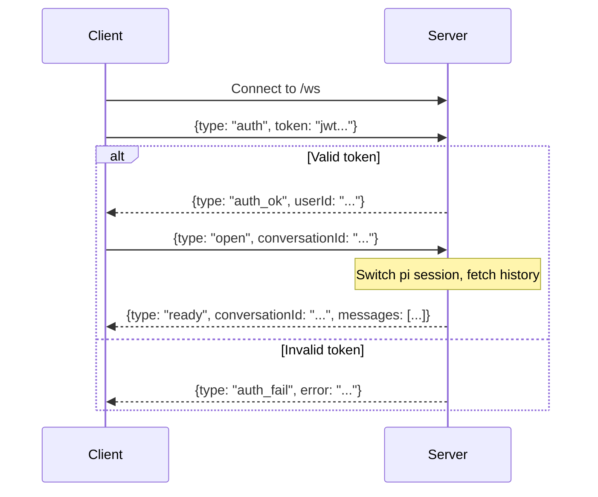
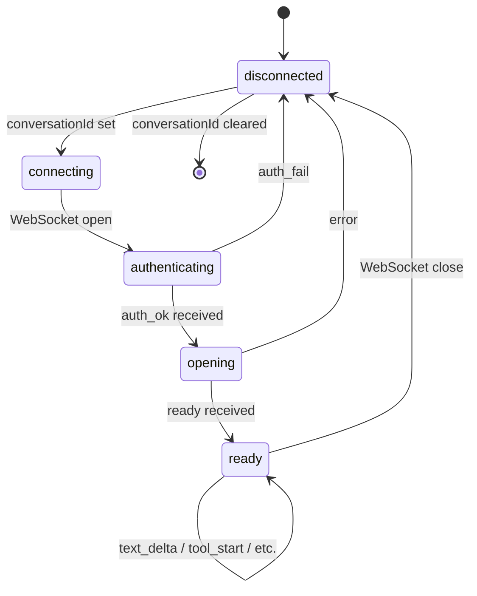

# WebSocket Protocol

The frontend communicates with the server over a single WebSocket connection at `/ws`. Messages are JSON, one per frame.

## Connection Lifecycle



## Client → Server Messages

### auth

Authenticate the connection with a JWT token.

```json
{"type": "auth", "token": "eyJ..."}
```

### open

Open a conversation. Switches the pi session and loads message history.

```json
{"type": "open", "conversationId": "uuid"}
```

### prompt

Send a message to the agent. Only valid after `ready` is received.

```json
{"type": "prompt", "text": "Hello, world!"}
```

### abort

Cancel the current agent operation.

```json
{"type": "abort"}
```

## Server → Client Messages

### auth_ok / auth_fail

```json
{"type": "auth_ok", "userId": "uuid"}
{"type": "auth_fail", "error": "Invalid or expired token"}
```

### ready

Session is open and ready for prompts. Includes message history if the conversation has prior messages.

```json
{
  "type": "ready",
  "conversationId": "uuid",
  "messages": [
    {"role": "user", "text": "hello"},
    {"role": "assistant", "text": "Hi!", "toolCalls": [
      {"toolCallId": "tc_1", "toolName": "bash", "args": {"command": "ls"}, "result": "file.txt\n", "isError": false}
    ]}
  ]
}
```

### text_delta

Streaming text content from the assistant.

```json
{"type": "text_delta", "delta": "Hello "}
```

### thinking_delta

Streaming thinking/reasoning content.

```json
{"type": "thinking_delta", "delta": "Let me consider..."}
```

### tool_start

A tool call has started. Sent when the model begins generating tool arguments.

```json
{"type": "tool_start", "toolName": "write", "toolCallId": "tc_1", "args": {}}
```

Sent again when arguments are fully parsed (with populated `args`):

```json
{"type": "tool_start", "toolName": "write", "toolCallId": "tc_1", "args": {"file_path": "chess.py", "content": "..."}}
```

### tool_update

Streaming tool argument content (e.g., file content being written).

```json
{"type": "tool_update", "toolCallId": "tc_1", "content": "import chess\n"}
```

### tool_end

Tool execution completed.

```json
{"type": "tool_end", "toolName": "bash", "toolCallId": "tc_1", "result": "file.txt\nREADME.md\n", "isError": false}
```

### message_end

The current assistant message is complete.

```json
{"type": "message_end"}
```

### agent_end

The agent has finished processing (all turns, tool calls, and follow-ups complete).

```json
{"type": "agent_end"}
```

### error

An error occurred.

```json
{"type": "error", "error": "No active session"}
```

## Frontend State Machine



## Multi-Tab Behaviour

Multiple browser tabs for the same user share the same Bridge on the server. All tabs receive all events from the Bridge. If tab A sends a prompt while tab B is viewing the same conversation, both tabs see the response streaming.
