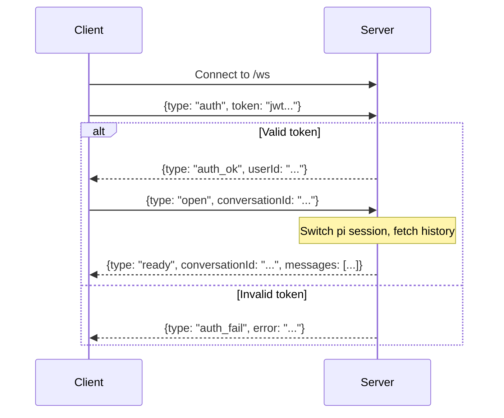
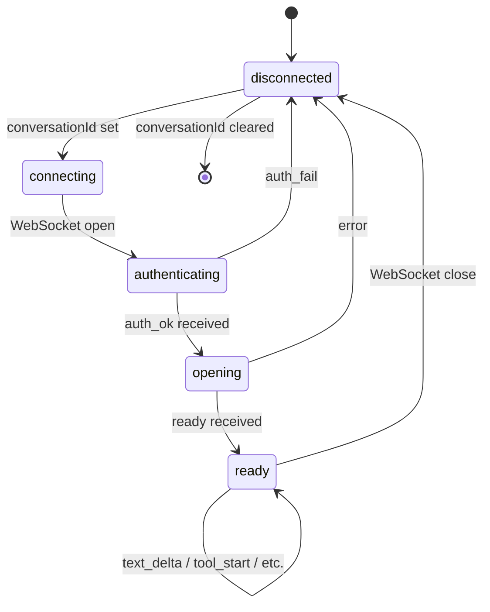

# WebSocket Protocol

The frontend communicates with the server over a single WebSocket connection at `/ws`. Messages are JSON, one per frame.

## Connection Lifecycle



## Client → Server Messages

### auth

Authenticate the connection with a JWT token.

```json
{"type": "auth", "token": "eyJ..."}
```

### open

Open a conversation. Switches the pi session and loads message history.

```json
{"type": "open", "conversationId": "uuid"}
```

### prompt

Send a message to the agent. Only valid after `ready` is received. Optionally attach workspace file paths as context.

```json
{"type": "prompt", "text": "Hello, world!", "files": ["structure.cif"]}
```

### abort

Cancel the current agent operation.

```json
{"type": "abort"}
```

## Server → Client Messages

### auth_ok / auth_fail

```json
{"type": "auth_ok", "userId": "uuid"}
{"type": "auth_fail", "error": "Invalid or expired token"}
```

### ready

Session is open and ready for prompts. Includes message history if the conversation has prior messages.

```json
{
  "type": "ready",
  "conversationId": "uuid",
  "messages": [
    {
      "role": "user",
      "text": "hello"
    },
    {
      "role": "assistant",
      "text": "Hi! Let me look at your structure.",
      "toolCalls": [
        {
          "toolCallId": "tc_1",
          "toolName": "bash",
          "args": {"command": "ls"},
          "result": "file.txt\n",
          "isError": false
        }
      ]
    }
  ]
}
```

### text_delta

Streaming text content from the assistant. Appended to the current assistant message.

```json
{"type": "text_delta", "delta": "Hello "}
```

### thinking_delta

Streaming thinking/reasoning content from the model. Appended to the thinking block.

```json
{"type": "thinking_delta", "delta": "Let me consider..."}
```

### tool_start

A tool call has been fully parsed (arguments are available). Sent once per tool call when argument generation completes.

```json
{"type": "tool_start", "toolName": "write", "toolCallId": "tc_1", "args": {"file_path": "chess.py", "content": "..."}}
```

### tool_update

Streaming tool argument content — e.g., file content being written character by character.

```json
{"type": "tool_update", "toolCallId": "tc_1", "content": "import chess\n"}
```

### tool_end

Tool execution completed.

```json
{"type": "tool_end", "toolName": "bash", "toolCallId": "tc_1", "result": "file.txt\nREADME.md\n", "isError": false}
```

### message_end

The current assistant message is complete.

```json
{"type": "message_end"}
```

### agent_end

The agent has finished processing (all turns, tool calls, and follow-ups complete).

```json
{"type": "agent_end"}
```

### error

An error occurred.

```json
{"type": "error", "error": "No active session"}
```

## Frontend State Machine



## Workspace Refresh

After a `tool_end` for `write`, `edit`, or `bash` tools, and after `agent_end`, the frontend schedules a file store refresh (250ms debounce). This keeps the workspace file tree current without polling.

## Multi-Tab Behaviour

Multiple browser tabs for the same user share the same Bridge on the server. All tabs receive all events from the Bridge. If tab A sends a prompt while tab B is viewing the same conversation, both tabs see the response streaming.

The frontend uses a generation counter in `useAgent` to discard messages from stale connections — if the user switches conversations rapidly, old WebSocket messages for the previous conversation are dropped.
