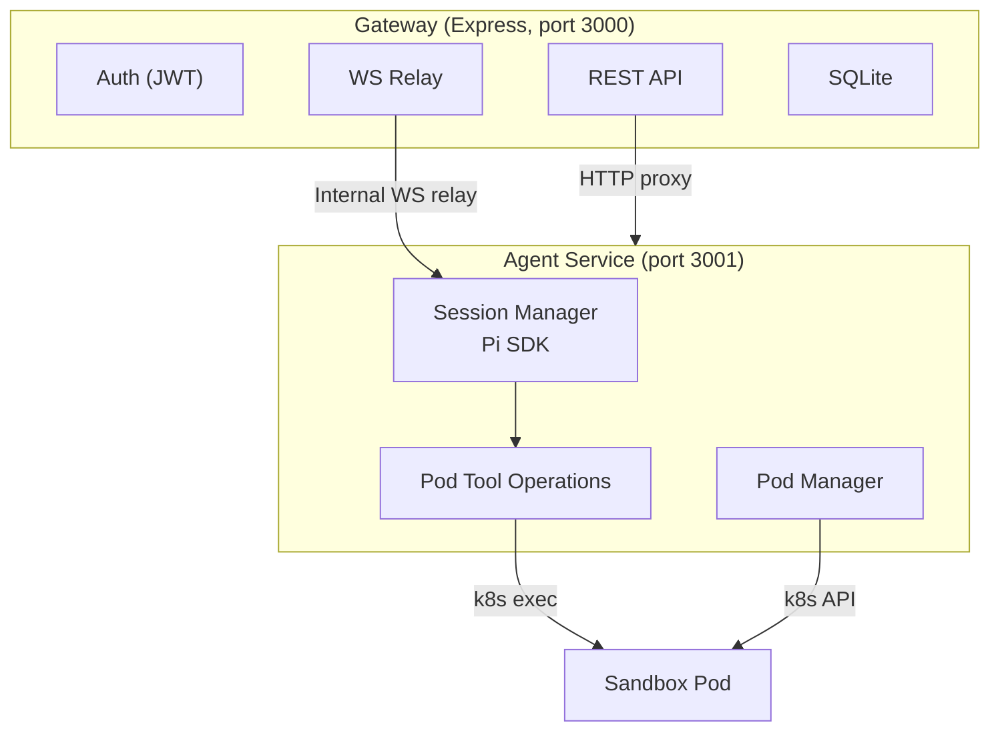

# Backend Architecture

## Overview

The system has two Node processes: a **Gateway** (Express, port 3000) handling auth and REST, and an **Agent Service** (port 3001) running the Pi SDK. The gateway relays browser WebSocket connections to the agent-service over an internal WebSocket.

## Key Modules

### Session Manager (`sessions.ts`)

Creates and manages Pi SDK `AgentSession` instances, keyed by `userId:conversationId`. Handles:

- `subscribe(userId, conversationId, callback)`: Subscribe to session events
- `switchSession(userId, conversationId, sessionPath)`: Switch Pi to a different conversation
- `prompt(userId, conversationId, text)`: Send a prompt via the SDK
- `abort(userId, conversationId)`: Cancel the current prompt
- `getMessages(userId, conversationId)`: Fetch conversation history
- `getAvailableModels(userId)`: List models with valid API keys
- `setModel(userId, modelId)`: Switch the active model
- `deleteConversation(userId, sessionPath)`: Clean up session files

### Pod Tool Operations (`pod-tool-operations.ts`)

Provides pluggable operations backends for the Pi SDK's built-in tools. Instead of running tools locally, all execution is routed through the user's sandbox pod via k8s exec:

- **Bash**: `execInPod(userId, command)` with stdout/stderr streaming and exit status
- **Read**: `cat` the file from the pod, detect image mime types
- **Write**: base64-encoded content piped to the pod filesystem
- **Edit**: read-modify-write via pod exec
- **Find/Grep/Ls**: shell commands in the pod

This keeps all tool execution in the pod (the "hands") while the SDK orchestrates reasoning in the agent-service (the "brain").

### Pod Manager (`pod-manager.ts`)

Manages k8s infrastructure. Knows nothing about Pi or sessions. Handles:

- **Pod lifecycle**: Create, verify, delete. Init container to fix hostPath permissions.
- **Volume provisioning**: hostPath volumes at `./data/homes/{userId}/` on host, mounted at `/home/node` in pod
- **Exec**: Starts processes inside pods, returns stdin/stdout/stderr streams
- **Idle timeout**: Evicts pods with no activity after 30 minutes
- **Failure backoff**: Immediate → 5s → 30s → surface error to user

### WebSocket Relay (`websocket.ts`)

The gateway's WebSocket handler. Authenticates browser connections via JWT, opens an internal WebSocket to the agent-service, and relays messages between them. Key properties:

- **Per-conversation isolation**: each browser auth opens a fresh agent-service WS with a generation counter
- **Re-auth safety**: re-authentication closes the old agent WS (generation-guarded) before opening a new one
- **Keepalive**: 30s ping/pong on both browser and agent connections, 60s timeout
- **TTFT tracking**: records time from prompt send to first text/thinking/tool delta

### Agent Service Client (`agent-service-client.ts`)

Internal HTTP proxy for REST routes that need agent-service data (models, conversation deletion). Adds `x-goldilocks-shared-secret` and `x-goldilocks-user-id` headers.

### Readiness and Health (`app.ts`)

| Endpoint | Purpose |
|----------|---------|
| `GET /api/health` | Liveness — always returns `{status: "ok"}` |
| `GET /api/ready` | Readiness — checks DB and agent-service connectivity |
| `GET /api/metrics` | Observability — relay counters and TTFT percentiles |

### Relay Metrics (`relay-metrics.ts`)

Lightweight counters tracked by the gateway:
- Browser/agent WS connections (total and active)
- Auth attempts and failures
- Relay errors
- TTFT samples with p50/p95/p99 percentiles

## Agent Service Internals

The agent-service (`agent-service/src/index.ts`) is a self-contained HTTP/WebSocket server that owns all Pi SDK state.

### Internal Auth

Gateway connections authenticate with `{type: "auth", userId, gatewayToken}`. The `gatewayToken` must match `CONFIG.agentServiceSharedSecret`, which throws in production if the env var is not set.

### Metrics (`agent-service/src/metrics.ts`)

- Gateway connections (total and active)
- Active prompts and total prompt count
- Internal auth failures
- WebSocket errors
- TTFT samples with p50/p95/p99

### Internal Endpoints

| Endpoint | Purpose |
|----------|---------|
| `GET /api/health` | Liveness |
| `GET /api/ready` | Readiness (checks DB) |
| `GET /api/metrics` | Counters and TTFT |
| `GET /internal/models` | List available models (proxied from gateway) |
| `POST /internal/models/select` | Select model (proxied from gateway) |
| `POST /internal/sessions/delete` | Delete session files (proxied from gateway) |
| `POST /internal/prewarm` | Pre-warm a session for a conversation |

## REST API

### Auth

| Endpoint | Method | Description |
|----------|--------|-------------|
| `/api/auth/register` | POST | Create account (email, password, displayName) |
| `/api/auth/login` | POST | Get JWT token (email, password) |
| `/api/auth/me` | GET | Validate token → user profile |

### Conversations

| Endpoint | Method | Description |
|----------|--------|-------------|
| `/api/conversations` | GET | List user's conversations |
| `/api/conversations` | POST | Create new conversation |
| `/api/conversations/:id/messages` | GET | Fetch message history |
| `/api/conversations/:id` | PATCH | Rename conversation |
| `/api/conversations/:id` | DELETE | Delete conversation + session files |

### Files

Files live on the user's pod filesystem at `/home/node/`. All operations exec into the pod. Scoped per user.

| Endpoint | Method | Description |
|----------|--------|-------------|
| `/api/files` | GET | List workspace tree |
| `/api/files/:path` | GET | Read file content |
| `/api/files/:path` | PUT | Create or update file |
| `/api/files/:path` | DELETE | Delete file or directory |
| `/api/files/:path/raw` | GET | Raw binary download |
| `/api/files/upload` | POST | Upload file (base64) |
| `/api/files/move` | POST | Move or rename |
| `/api/files/mkdir` | POST | Create directory |

### Models

| Endpoint | Method | Description |
|----------|--------|-------------|
| `/api/models` | GET | List available models (proxied to agent-service) |
| `/api/models/select` | POST | Set active model (proxied to agent-service) |

### Settings

| Endpoint | Method | Description |
|----------|--------|-------------|
| `/api/settings` | GET | Fetch user settings |
| `/api/settings` | PATCH | Merge update settings |
| `/api/settings/api-keys` | GET | List API key metadata |
| `/api/settings/api-key` | PUT | Store encrypted API key |
| `/api/settings/api-key/:provider` | DELETE | Remove API key |

### Structures

| Endpoint | Method | Description |
|----------|--------|-------------|
| `/api/structures` | GET | List user's saved structures |
| `/api/structures` | POST | Save a structure |
| `/api/structures/search` | POST | Search public databases |
| `/api/library` | GET | Public CIF structure library |

### QuickGen

| Endpoint | Method | Description |
|----------|--------|-------------|
| `/api/quickgen/predict` | POST | ML k-point prediction |
| `/api/quickgen/generate` | POST | Generate QE input |

### System

| Endpoint | Method | Description |
|----------|--------|-------------|
| `/api/health` | GET | Liveness check |
| `/api/ready` | GET | Readiness (DB + agent-service) |
| `/api/metrics` | GET | Relay counters and TTFT |
| `/ws` | WS | WebSocket (auth → open → prompt) |