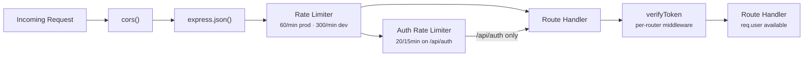
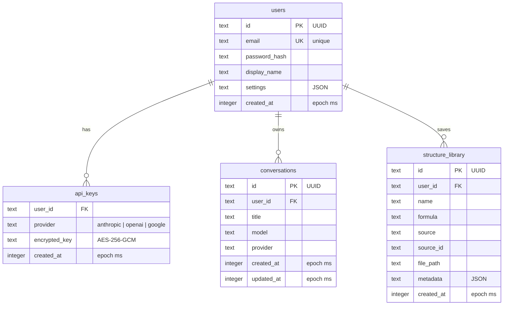
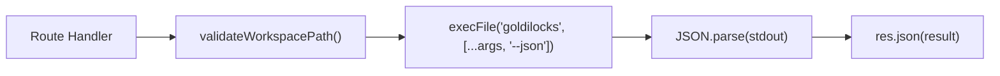

# Backend Architecture

Express 5 + TypeScript + better-sqlite3 + WebSocket (ws).

Source: `server/src/`.

## Request Lifecycle

Every HTTP request flows through the same middleware stack before reaching
route handlers:



**Note:** `verifyToken` is not global middleware — it's applied per-router
inside each route file. The health endpoint and login/register routes skip it.

## Route Registration

All routes are registered in `server/src/index.ts`:

```ts
app.use('/api/auth',          authRoutes);          // auth/routes.ts
app.use('/api/conversations',  conversationRoutes);  // conversations/routes.ts
app.use('/api/conversations',  fileRoutes);          // files/routes.ts (nested under convs)
app.use('/api/models',         modelRoutes);          // models/routes.ts
app.use('/api/settings',       settingsRoutes);       // settings/routes.ts
app.use('/api/structures',     structureRoutes);      // structures/routes.ts
app.use('/api/library',        libraryRouter);        // structures/routes.ts (exported separately)
app.use('/api',                quickgenRoutes);        // quickgen/routes.ts (/predict, /generate)
```

### Route File Pattern

Every route file follows the same structure:

```ts
// server/src/<domain>/routes.ts
import { Router, Response } from 'express';
import { verifyToken, AuthRequest } from '../auth/middleware.js';

const router = Router();
router.use(verifyToken);  // All routes in this file require JWT

router.get('/', (req: AuthRequest, res: Response) => {
  const userId = req.user!.id;  // Always available after verifyToken
  // ...
});

export default router;
```

### Route Map

| Method | Path | Handler File | Auth | Description |
|--------|------|-------------|------|-------------|
| `GET` | `/api/health` | `index.ts` (inline) | No | Health check |
| `POST` | `/api/auth/register` | `auth/routes.ts` | No | Create account |
| `POST` | `/api/auth/login` | `auth/routes.ts` | No | Login |
| `POST` | `/api/auth/refresh` | `auth/routes.ts` | Yes | Refresh JWT |
| `GET` | `/api/auth/me` | `auth/routes.ts` | Yes | Get profile |
| `GET` | `/api/conversations` | `conversations/routes.ts` | Yes | List conversations |
| `POST` | `/api/conversations` | `conversations/routes.ts` | Yes | Create conversation |
| `GET` | `/api/conversations/:id` | `conversations/routes.ts` | Yes | Get conversation |
| `PATCH` | `/api/conversations/:id` | `conversations/routes.ts` | Yes | Update conversation |
| `DELETE` | `/api/conversations/:id` | `conversations/routes.ts` | Yes | Delete conversation |
| `GET` | `/api/conversations/:id/files` | `files/routes.ts` | Yes | List workspace files |
| `POST` | `/api/conversations/:id/upload` | `files/routes.ts` | Yes | Upload file (base64 JSON) |
| `GET` | `/api/conversations/:id/files/:name` | `files/routes.ts` | Yes | Download file |
| `GET` | `/api/conversations/:id/files/:name/content` | `files/routes.ts` | Yes | Read file as text |
| `DELETE` | `/api/conversations/:id/files/:name` | `files/routes.ts` | Yes | Delete file |
| `GET` | `/api/models` | `models/routes.ts` | Yes | Available LLMs |
| `GET` | `/api/settings` | `settings/routes.ts` | Yes | User settings |
| `PATCH` | `/api/settings` | `settings/routes.ts` | Yes | Update settings |
| `GET` | `/api/settings/api-keys` | `settings/routes.ts` | Yes | API key metadata |
| `PUT` | `/api/settings/api-key` | `settings/routes.ts` | Yes | Store encrypted key |
| `DELETE` | `/api/settings/api-key/:provider` | `settings/routes.ts` | Yes | Remove key |
| `POST` | `/api/structures/search` | `structures/routes.ts` | Yes | Search databases |
| `POST` | `/api/structures/fetch` | `structures/routes.ts` | Yes | Fetch structure to workspace |
| `GET` | `/api/library` | `structures/routes.ts` | Yes | List saved structures |
| `POST` | `/api/library` | `structures/routes.ts` | Yes | Save to library |
| `DELETE` | `/api/library/:id` | `structures/routes.ts` | Yes | Remove from library |
| `POST` | `/api/predict` | `quickgen/routes.ts` | Yes | ML k-point prediction |
| `POST` | `/api/generate` | `quickgen/routes.ts` | Yes | QE input generation |

## Database

SQLite via `better-sqlite3` with WAL journal mode and foreign keys enabled.

### Schema



### Migrations

SQL files in `server/src/migrations/` (e.g., `001_init.sql`), applied in
alphabetical order on server start by `db.ts`:

```ts
// db.ts — runMigrations()
// 1. Creates `migrations` tracking table if not exists
// 2. Reads .sql files from migrations/ dir
// 3. Skips already-applied migrations
// 4. Runs each new migration in a transaction
```

### Connection

`db.ts` exports `getDb()` (lazy singleton) and `closeDb()`. The database file
lives at `CONFIG.dataDir/goldilocks.db`. WAL mode and foreign keys are enabled
on connection.

## Goldilocks CLI Integration

The `structures/routes.ts` and `quickgen/routes.ts` files invoke the `goldilocks`
binary via `child_process.execFile()`:



- `--json` flag for machine-readable output
- 30s timeout for search/fetch, 60s for predict/generate
- Workspace path as CWD for generate commands
- Binary located at `bin/goldilocks`, symlinked into each conversation workspace

## Configuration

`server/src/config.ts` exports a single `CONFIG` object that reads all
environment variables with typed defaults:

| Key | Env Var | Default | Notes |
|-----|---------|---------|-------|
| `port` | `PORT` | `3000` | |
| `nodeEnv` | `NODE_ENV` | `development` | |
| `dataDir` | `DATA_DIR` | `./data` | |
| `workspaceRoot` | `WORKSPACE_ROOT` | `./data/workspaces` | |
| `jwtSecret` | `JWT_SECRET` | dev fallback | **Throws in production if unset** |
| `encryptionKey` | `ENCRYPTION_KEY` | dev fallback | **Throws in production if unset** |
| `maxSessions` | `MAX_SESSIONS` | `20` | Legacy, kept for reference |
| `sessionIdleTimeoutMs` | `SESSION_IDLE_TIMEOUT_MS` | `300000` (5 min) | Legacy, kept for reference |
| `k8sNamespace` | `K8S_NAMESPACE` | `goldilocks` | k8s namespace for agent pods |
| `agentImage` | `AGENT_IMAGE` | `goldilocks-agent:latest` | Container image for agent pods |
| `agentIdleTimeoutMs` | `AGENT_IDLE_TIMEOUT_MS` | `1800000` (30 min) | Idle timeout before agent pod is deleted |
| `workspaceQuotaBytes` | `WORKSPACE_QUOTA_BYTES` | `1073741824` (1 GB) | Per-user workspace size |
| `anthropicApiKey` | `ANTHROPIC_API_KEY` | — | Server-wide key |
| `openaiApiKey` | `OPENAI_API_KEY` | — | Server-wide key |
| `googleApiKey` | `GOOGLE_API_KEY` | — | Server-wide key |

## Static File Serving

In production, `index.ts` serves the built frontend from `frontend/dist/`:

```ts
const frontendDist = resolve(process.cwd(), 'frontend', 'dist');
if (existsSync(frontendDist)) {
  app.use(express.static(frontendDist));
  // SPA catch-all: Express 5 syntax requires named parameter
  app.get('/{*splat}', (req, res, next) => {
    if (req.path.startsWith('/api') || req.path.startsWith('/ws')) return next();
    res.sendFile(resolve(frontendDist, 'index.html'));
  });
}
```

In development, Vite's dev server (port 5173) proxies `/api` and `/ws` to the
Express server (port 3000) — see `frontend/vite.config.ts`.
