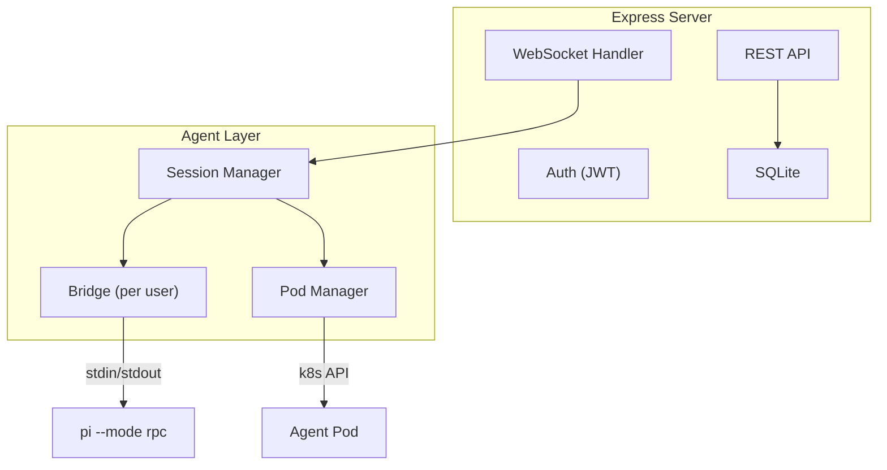

# Backend Architecture

## Overview

The Express server is a thin wrapper around Pi. It handles auth, stores conversation metadata in SQLite, and bridges WebSocket connections to per-user Bridge instances.

## Key Modules

### Session Manager (`sessions.ts`)

Maps `userId` → `Bridge` instance. One Bridge per user, not per conversation. Handles:

- `getOrCreateBridge(userId)`: Ensures pod exists, execs pi, creates Bridge, caches it
- `switchSession(userId, sessionPath)`: Tells pi to switch to a different session file
- `prompt(userId, text)`: Sends a prompt and waits for `agent_end`
- `getMessages(userId)`: Fetches conversation history from pi
- `getAvailableModels(userId)`: Queries pi for models with valid API keys

Deduplicates concurrent connection attempts — if two requests try to create a Bridge for the same user simultaneously, only one connection is made.

### Bridge (`bridge.ts`)

The only code that talks to Pi. Takes stdin/stdout streams (doesn't know where they come from). Handles:

- **JSONL parsing**: Line-based buffering, splits on `\n`
- **RPC correlation**: Sends commands with UUIDs, matches responses by ID, timeouts after 30s
- **Event dispatch**: Forwards Pi events to all subscribers
- **Text accumulation**: Tracks `text_delta` events, falls back to `message_end` content if no deltas arrive
- **Logging**: Every send/recv logged to `data/logs/bridge-{userId}.log`

### Pod Manager (`pod-manager.ts`)

Manages k8s infrastructure. Knows nothing about Pi or RPC. Handles:

- **Pod lifecycle**: Create, verify, delete. Init container to fix hostPath permissions.
- **Volume provisioning**: hostPath volumes at `./data/homes/{userId}/` on host, mounted at `/home/node` in pod
- **Exec**: Starts processes inside pods, returns stdin/stdout/stderr streams
- **Idle timeout**: Evicts pods with no activity after 30 minutes (configurable)
- **Failure backoff**: Immediate → 5s → 30s → surface error to user

### WebSocket Handler (`websocket.ts`)

Translates between the frontend WebSocket protocol and Bridge events. Handles:

- Auth verification (JWT)
- Conversation open (session switching via pi RPC)
- Message history loading (pi `get_messages` → frontend format)
- Event mapping: `message_update` → `text_delta`, `tool_execution_end` → `tool_end`, etc.
- Tool call ID mapping between model-generated IDs and pi execution IDs
- Auto-generating conversation titles from the first user message

## REST API

| Endpoint | Method | Description |
|----------|--------|-------------|
| `/api/health` | GET | Health check |
| `/api/auth/register` | POST | Create account |
| `/api/auth/login` | POST | Get JWT token |
| `/api/conversations` | GET | List conversations |
| `/api/conversations` | POST | Create conversation |
| `/api/conversations/:id` | PATCH | Rename conversation |
| `/api/conversations/:id` | DELETE | Delete conversation + pi session |
| `/api/models` | GET | List available models (from pi) |
| `/api/models/select` | POST | Set active model (via pi RPC) |
| `/api/files` | GET | List workspace files (via exec) |
| `/api/files/upload` | POST | Upload file to workspace (via exec) |
| `/api/files/:name/content` | GET | Read file content (via exec) |
| `/api/files/:name` | DELETE | Delete file (via exec) |
| `/api/settings` | GET/PATCH | User settings |
| `/api/settings/api-keys` | GET | List API key metadata |
| `/api/settings/api-key` | PUT/DELETE | Set/remove API key |
