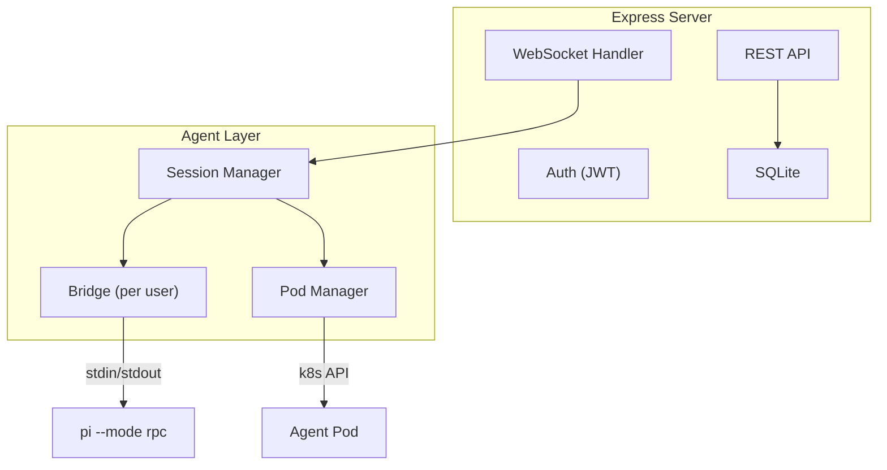

# Backend Architecture

## Overview

The Express server is a thin wrapper around Pi. It handles auth, stores conversation metadata in SQLite, and bridges WebSocket connections to per-user Bridge instances.

## Key Modules

### Session Manager (`sessions.ts`)

Maps `userId` → `Bridge` instance. One Bridge per user, not per conversation. Handles:

- `getOrCreateBridge(userId)`: Ensures pod exists, execs pi, creates Bridge, caches it
- `switchSession(userId, sessionPath)`: Tells pi to switch to a different session file
- `prompt(userId, text)`: Sends a prompt and waits for `agent_end`
- `getMessages(userId)`: Fetches conversation history from pi
- `getAvailableModels(userId)`: Queries pi for models with valid API keys
- `setModel(userId, modelId)`: Switches the active model via pi RPC

Deduplicates concurrent connection attempts — if two requests try to create a Bridge for the same user simultaneously, only one connection is made.

### Bridge (`bridge.ts`)

The only code that talks to Pi. Takes stdin/stdout streams (doesn't know where they come from). Handles:

- **JSONL parsing**: Line-based buffering, splits on `\n`
- **RPC correlation**: Sends commands with UUIDs, matches responses by ID, timeouts after 30s
- **Event dispatch**: Forwards Pi events to all subscribers
- **Text accumulation**: Tracks `text_delta` events, falls back to `message_end` content if no deltas arrive
- **Logging**: Every send/recv logged to `data/logs/bridge-{userId}.log`

### Pod Manager (`pod-manager.ts`)

Manages k8s infrastructure. Knows nothing about Pi or RPC. Handles:

- **Pod lifecycle**: Create, verify, delete. Init container to fix hostPath permissions.
- **Volume provisioning**: hostPath volumes at `./data/homes/{userId}/` on host, mounted at `/home/node` in pod
- **Exec**: Starts processes inside pods, returns stdin/stdout/stderr streams
- **Idle timeout**: Evicts pods with no activity after 30 minutes (configurable)
- **Failure backoff**: Immediate → 5s → 30s → surface error to user

### WebSocket Handler (`websocket.ts`)

Translates between the frontend WebSocket protocol and Bridge events. Handles:

- Auth verification (JWT)
- Conversation open (session switching via pi RPC)
- Message history loading (pi `get_messages` → frontend format)
- Event mapping: `message_update` → `text_delta`, `tool_execution_end` → `tool_end`, etc.
- Tool call ID mapping between model-generated IDs and pi execution IDs

### Workspace Guard (`workspace-guard.ts`)

Security boundary for workspace operations. Intercepts all file exec commands and path arguments, stripping `/home/node/` prefixes and blocking `..` traversal. Every exec command is validated before reaching `execInPod`.

## REST API

### Auth

| Endpoint | Method | Description |
|----------|--------|-------------|
| `/api/auth/register` | POST | Create account (email, password, displayName) |
| `/api/auth/login` | POST | Get JWT token (email, password) |
| `/api/auth/me` | GET | Validate token → user profile |

### Conversations

| Endpoint | Method | Description |
|----------|--------|-------------|
| `/api/conversations` | GET | List user's conversations |
| `/api/conversations` | POST | Create new conversation |
| `/api/conversations/:id/messages` | GET | Fetch message history |
| `/api/conversations/:id` | PATCH | Rename conversation |
| `/api/conversations/:id` | DELETE | Delete conversation + pi session |

### Files

Files live on the user's pod filesystem at `/home/node/`. All operations exec into the pod. Scoped per user (not per conversation).

| Endpoint | Method | Description |
|----------|--------|-------------|
| `/api/files` | GET | List workspace tree (recursive, optional `?search=` query) |
| `/api/files/:path` | GET | Read file content |
| `/api/files/:path` | PUT | Create or update file (`{ content }`) |
| `/api/files/:path` | DELETE | Delete file or directory |
| `/api/files/:path/raw` | GET | Raw binary download |
| `/api/files/upload` | POST | Upload file (`{ filename, content: base64 }`) |
| `/api/files/move` | POST | Move or rename (`{ from, to }`) |
| `/api/files/mkdir` | POST | Create directory (`{ path }`) |

### Models

| Endpoint | Method | Description |
|----------|--------|-------------|
| `/api/models` | GET | List available models (from pi, filtered by available keys) |
| `/api/models/select` | POST | Set active model (`{ modelId }`) |

### Settings

Settings are stored as a JSON blob per user in `users.settings`. The server normalizes them to `{ settings: { ... } }` on read.

| Endpoint | Method | Description |
|----------|--------|-------------|
| `/api/settings` | GET | Fetch user settings → `{ settings: { defaultModel, defaultFunctional, ... } }` |
| `/api/settings` | PATCH | Merge update user settings |
| `/api/settings/api-keys` | GET | List API key metadata (no secrets) |
| `/api/settings/api-key` | PUT | Store encrypted API key (`{ provider, key }`) |
| `/api/settings/api-key/:provider` | DELETE | Remove API key |

### Structures

| Endpoint | Method | Description |
|----------|--------|-------------|
| `/api/structures` | GET | List user's saved structures |
| `/api/structures` | POST | Save a structure |
| `/api/structures/search` | POST | Search public databases (JARVIS, MP, MC3D, OQMD) |
| `/api/library` | GET | Public CIF structure library |

### QuickGen

No-chat QE input generation and ML prediction. Runs the `goldilocks` CLI binary.

| Endpoint | Method | Description |
|----------|--------|-------------|
| `/api/quickgen/predict` | POST | ML k-point prediction (ALIGNN, RF) |
| `/api/quickgen/generate` | POST | Generate QE input from structure + params |

### System

| Endpoint | Method | Description |
|----------|--------|-------------|
| `/api/health` | GET | Health check (no auth required) |
| `/ws` | WS | WebSocket (auth → open → prompt) |
