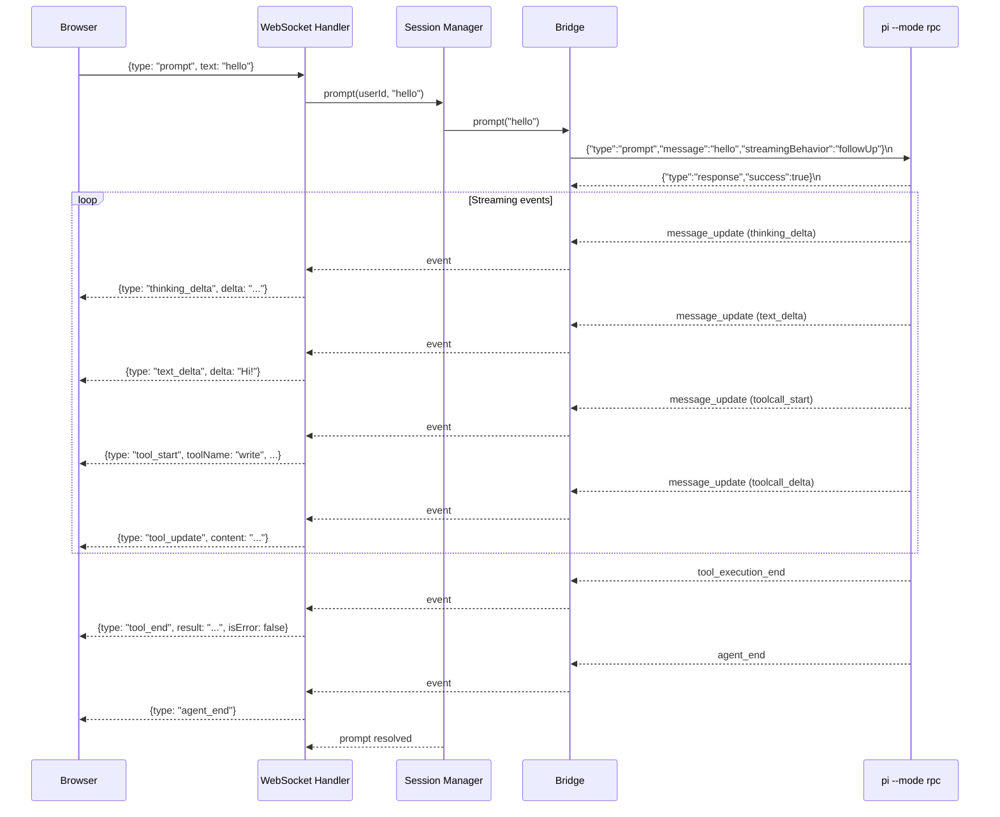
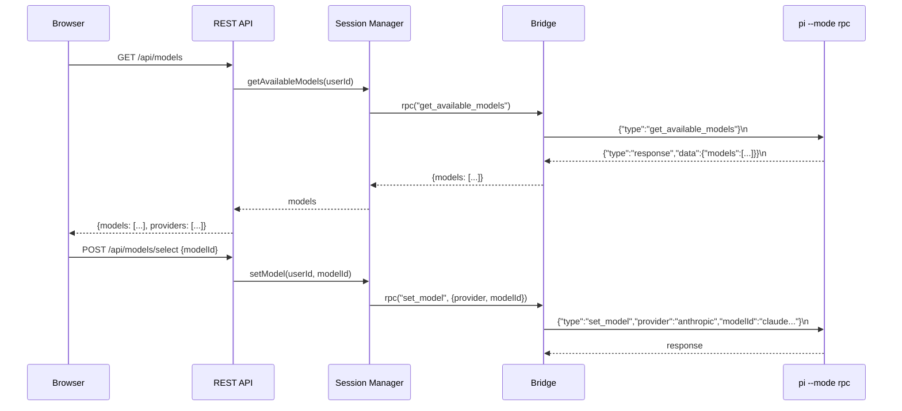
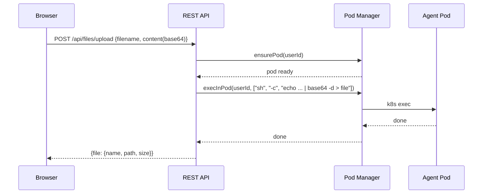
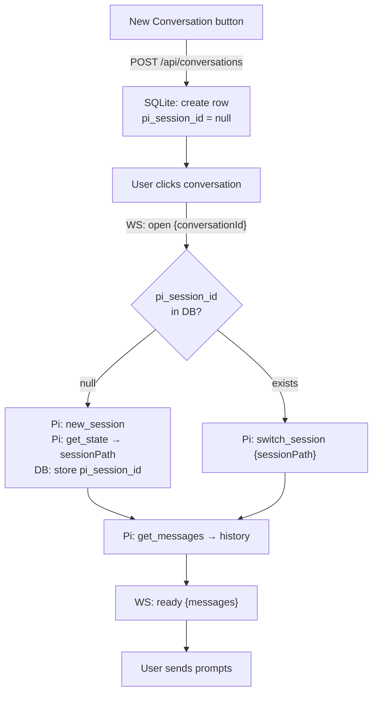
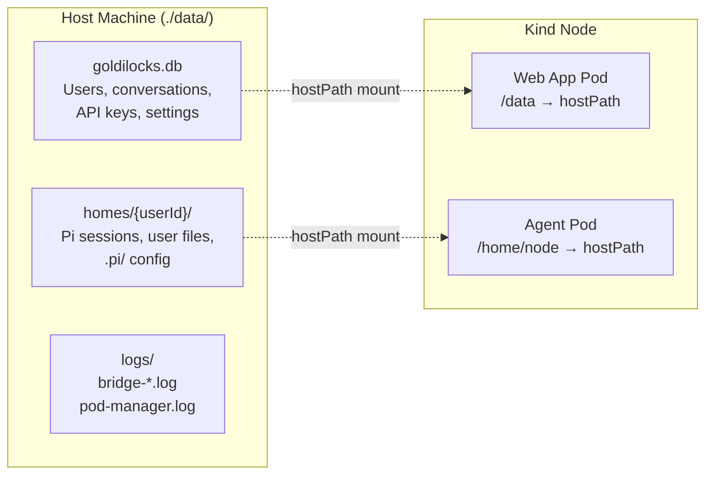

# Data Flow

## Prompt Flow

## Model Selection Flow

## File Upload Flow

## Conversation Lifecycle

## Data Persistence

All data survives pod restarts and cluster rebuilds because it lives on the host filesystem via bind-mounts.
