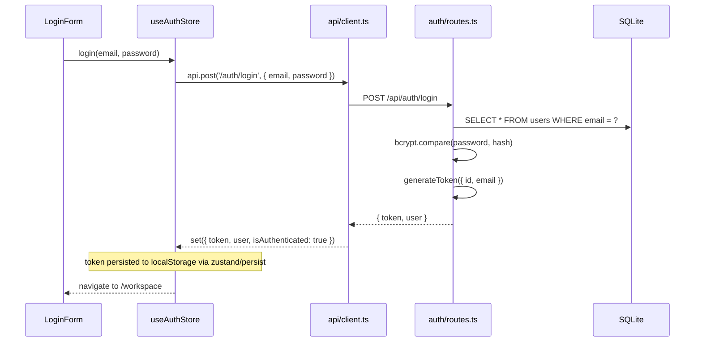
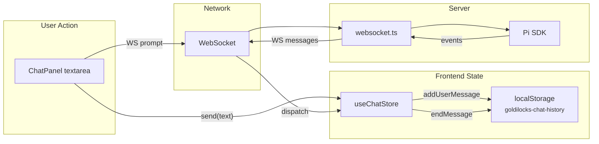
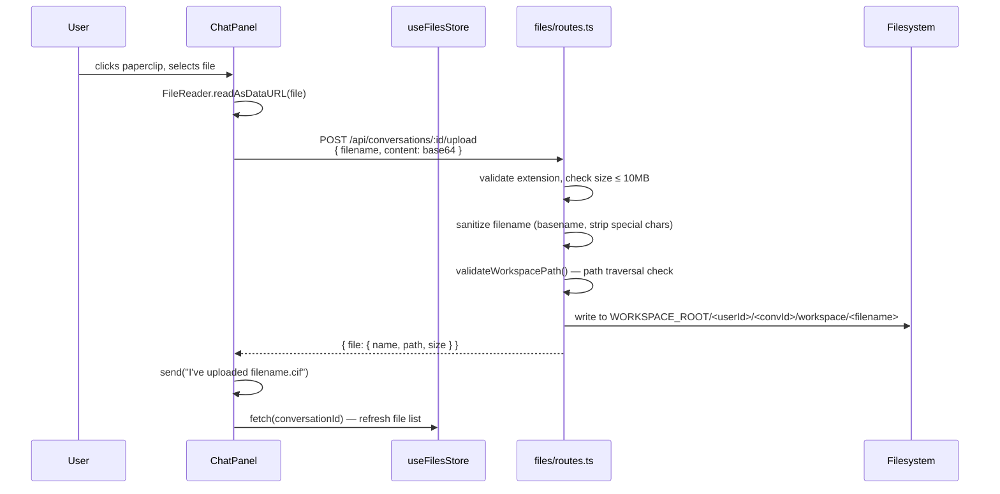
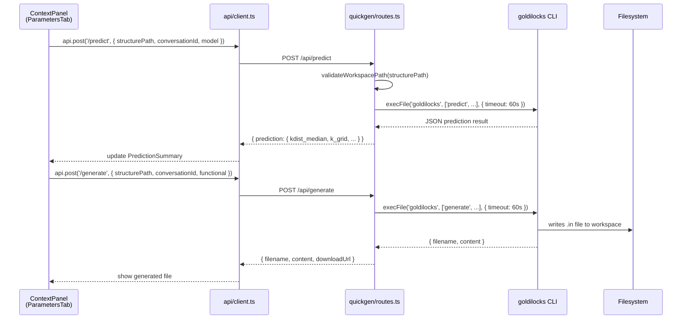

# Data Flow

How data moves through the system for each major user action.

## Authentication

The `api/client.ts` module automatically injects the Bearer token from
`useAuthStore.getState().token` into every subsequent request.

## Chat Message Flow

**Key detail:** Messages are stored in `localStorage` only, not in the server
database. The `conversations` table stores metadata (title, model, timestamps)
but not message content. This means clearing browser data loses chat history.

### Store Actions During Streaming

| WebSocket Event | Store Action | State Change |
|----------------|--------------|--------------|
| (user sends) | `addUserMessage(text)` | Appends user message, persists to localStorage |
| (user sends) | `startAssistantMessage()` | Sets `isStreaming=true`, clears `currentText`/`currentThinking`/`activeTools` |
| `text_delta` | `appendTextDelta(delta)` | Concatenates to `currentText` |
| `thinking_delta` | `appendThinkingDelta(delta)` | Concatenates to `currentThinking` |
| `tool_start` | `startToolCall(id, name, args)` | Adds to `activeTools` Map |
| `tool_end` | `endToolCall(id, result, isError)` | Updates tool in `activeTools` Map |
| `message_end` | `endMessage()` | Flushes `currentText`/`currentThinking`/`activeTools` into a `ChatMessage`, appends to `messages[]`, persists to localStorage |
| `agent_end` | `endAgent()` | Calls `endMessage()` if pending, sets `isStreaming=false` |

## File Upload Flow

Files are uploaded as **JSON with base64 content**, not multipart/form-data.
The `workspace-guard.ts` module validates that the resolved path stays within
the workspace directory (`resolve(basePath, filename).startsWith(basePath)`).

## Quick Generate Flow (No Agent)

This bypasses the AI agent entirely. The ContextPanel's "Parameters" tab calls
REST endpoints that invoke the `goldilocks` CLI directly via `child_process.execFile()`.
