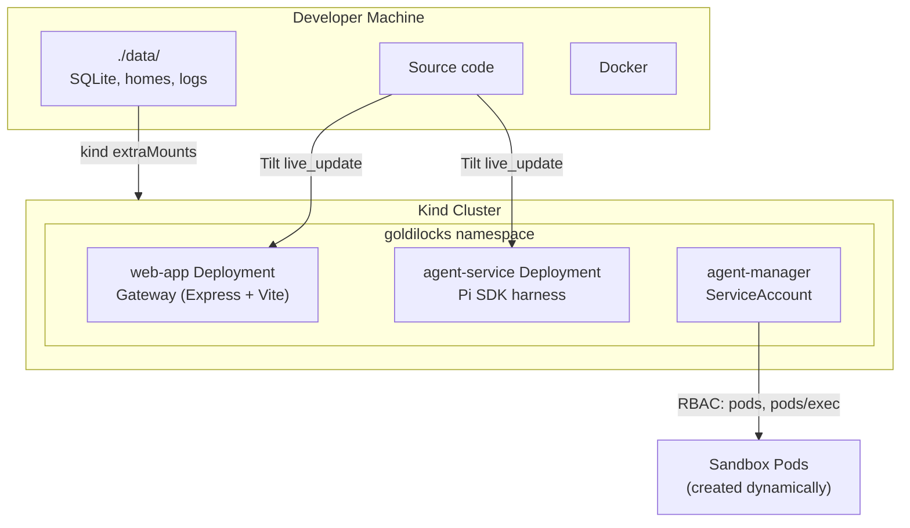

# Deployment

## Development (kind + Tilt)



### Kind Cluster Configuration

`npm run dev:setup` generates a kind config from `infra/kind/kind-config.template.yaml`:

```yaml
kind: Cluster
apiVersion: kind.x-k8s.io/v1alpha4
nodes:
  - role: control-plane
    extraMounts:
      - hostPath: ./data
        containerPath: /data/goldilocks
```

This bind-mounts `./data/` on the host into the kind node at `/data/goldilocks`. Both the web app (SQLite, logs) and sandbox pods (user homes) use hostPath volumes pointing under this path.

### Tilt Resources

| Resource | Type | Description |
|----------|------|-------------|
| `web-app` | k8s Deployment | Gateway + Vite dev server with live_update |
| `agent-service` | k8s Deployment | Agent service with live_update |
| `agent-image` | local_resource | Builds sandbox pod image and loads into kind |

### Images

| Image | Dockerfile | Purpose |
|-------|-----------|---------|
| `goldilocks-web` | `Dockerfile.web.dev` | Dev gateway (tsx watch + Vite) |
| `goldilocks-agent-service` | `Dockerfile.agent-service.dev` | Dev agent service |
| `goldilocks-agent` | `Dockerfile.agent` | Sandbox container (no pi, just `sleep infinity`) |

The sandbox image no longer includes pi. It's just a workspace environment with scientific tooling.

## Production

Production deployment requires:

- **Real k8s cluster** instead of kind
- **Production Dockerfiles** (multi-stage builds, no dev deps)
- **Ingress + TLS** for external access
- **Real secrets** (not dev defaults)
- **Network policies** to restrict sandbox pod egress
- **Resource quotas** per user pod
- **Prometheus adapter** for HPA custom metrics (`active_prompts`)
- **PVC** instead of hostPath for user homes (hostPath doesn't work across nodes)

## Kubernetes Resources

### Namespace

All resources live in the `goldilocks` namespace.

### RBAC

The `agent-manager` ServiceAccount is used by both the gateway and agent-service pods. It has permissions to:

- Create, delete, get, list, watch **pods** (for sandbox pod management)
- Get pod **logs** (for debugging)
- Create, get **pods/exec** (for tool execution)
- Create **pods/portforward** (reserved for future use)
- Get **secrets** (for HPC SSH key, future use)

### Gateway Deployment

- Port 3000 (Express), 5173 (Vite dev)
- Readiness probe: `/api/ready` (checks DB + agent-service)
- Liveness probe: `/api/health`
- `preStop: sleep 5` for graceful drain
- Resources: 250m–2 CPU, 512Mi–2Gi memory
- HPA: 2–10 replicas, 70% CPU

### Agent Service Deployment

- Port 3001
- Readiness probe: `/api/ready` (checks DB)
- Liveness probe: `/api/health`
- `preStp: sleep 5` for graceful drain
- Resources: 250m–2 CPU, 512Mi–2Gi memory
- HPA: 1–5 replicas, 70% CPU + `active_prompts` custom metric

### Agent Service Services

Two k8s Services for the agent-service:
- `agent-service` (port 3001) — HTTP traffic, nginx cookie affinity annotation
- `agent-service-ws` (port 3001) — WebSocket traffic, `ClientIP` session affinity with 3600s timeout

### Sandbox Pods (dynamic)

Created by the Pod Manager when a user first interacts. Each pod has:
- **Init container**: Runs as root to `chown` the hostPath volume for uid 1000
- **Main container**: Runs as uid 1000, `sleep infinity` — tools are exec'd in
- **Home volume**: hostPath under the local kind state root → `/home/node`
- **Tmp volume**: emptyDir for scratch space
- **No env vars with provider keys** — credentials stay in the agent-service