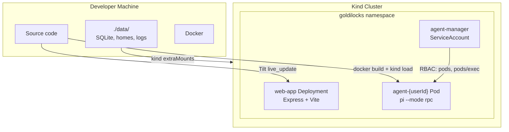

# Deployment

## Development (kind + Tilt)



### Kind Cluster Configuration

The kind cluster is configured via `deploy/kind-config.yaml`:

```yaml
kind: Cluster
apiVersion: kind.x-k8s.io/v1alpha4
nodes:
  - role: control-plane
    extraMounts:
      - hostPath: ./data
        containerPath: /data/goldilocks
```

This bind-mounts `./data/` on the host into the kind node at `/data/goldilocks`. Both the web app (SQLite, logs) and agent pods (user homes) use hostPath volumes pointing under this path.

### Tilt Resources

| Resource | Type | Description |
|----------|------|-------------|
| `web-app` | k8s Deployment | Express server + Vite dev server with live_update |
| `agent-image` | local_resource | Builds agent Docker image and loads into kind |
| `uncategorized` | k8s | Namespace, RBAC, secrets |

### Images

| Image | Dockerfile | Purpose |
|-------|-----------|---------|
| `goldilocks-web` | `Dockerfile.web.dev` | Dev web app (tsx watch + Vite) |
| `goldilocks-agent` | `Dockerfile.agent` | Agent container (pi installed, `sleep infinity`) |

The agent image is not deployed as a k8s resource — the web app creates agent pods dynamically. Tilt builds it and loads it into kind via `local_resource`.

## Production

Production deployment is planned but not yet implemented. Key differences from dev:

- **Real k8s cluster** instead of kind
- **Production Dockerfile** for web app (multi-stage build, no dev deps, `node server/dist/index.js`)
- **Ingress + TLS** for external access
- **Real secrets** (not dev defaults)
- **Network policies** to restrict agent pod egress
- **Resource quotas** per user pod
- **PVC** instead of hostPath for user homes (hostPath is not safe in multi-node clusters)

## Kubernetes Resources

### Namespace

All resources live in the `goldilocks` namespace.

### RBAC

The `agent-manager` ServiceAccount is used by the web app pod. It has permissions to:

- Create, delete, get, list, watch **pods** (for agent pod management)
- Get pod **logs** (for debugging)
- Create, get **pods/exec** (for Bridge communication and file operations)
- Create **pods/portforward** (reserved for future use)
- Get **secrets** (for HPC SSH key, future use)

### Web App Deployment

Single-replica deployment with:
- Ports: 3000 (Express), 5173 (Vite)
- Volume: hostPath at `/data/goldilocks` for SQLite and logs
- Probes: readiness and liveness on `/api/health`
- Resources: 250m-2 CPU, 512Mi-2Gi memory

### Agent Pods (dynamic)

Created by the Pod Manager when a user first interacts. Each pod has:
- **Init container**: Runs as root to `chown` the hostPath volume for uid 1000
- **Main container**: Runs as uid 1000, `sleep infinity`, pi exec'd in
- **Home volume**: hostPath at `./data/homes/{userId}/` → `/home/node`
- **Tmp volume**: emptyDir for scratch space
- **Env vars**: User API keys (decrypted from DB), `HOME=/home/node`
