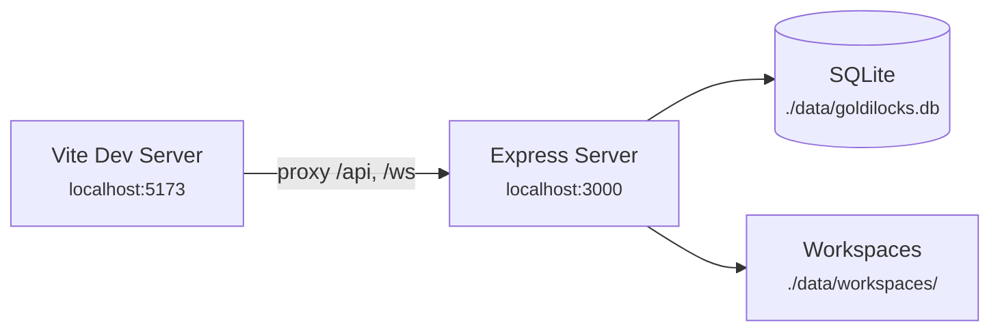
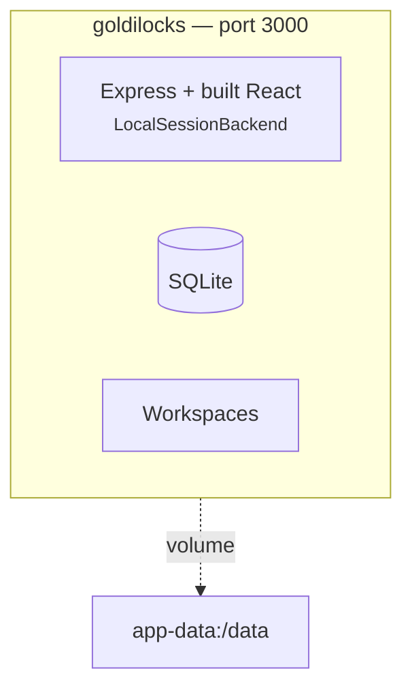
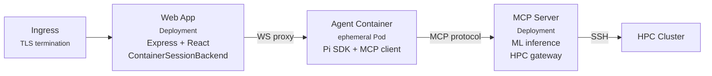

# Deployment

## Development (Local)



```bash
npm install
npm run dev     # starts both concurrently
```

Vite proxies `/api` and `/ws` to port 3000 (configured in `frontend/vite.config.ts`).
Both servers hot-reload on file changes.

## Docker Compose (Single User)



```bash
cp .env.example .env
# Edit .env — set JWT_SECRET, ENCRYPTION_KEY, and at least one API key
docker compose up -d
```

The `Dockerfile` at repo root is a multi-stage build:
1. **Stage 1:** Install dependencies (both workspaces)
2. **Stage 2:** Build frontend (`vite build`) and server (`tsc`)
3. **Stage 3:** Production image with only runtime dependencies and built artifacts

The single image serves both the API and the frontend as static files.

## Kubernetes (Multi-User Production)



### Three-Tier Architecture

| Component | Type | Persistence | Isolation | Access |
|-----------|------|-------------|-----------|--------|
| **Web App** | Deployment | Yes (PVC for SQLite + workspaces) | — | Serves UI, auth, API, manages agent lifecycle |
| **Agent** | Ephemeral Pod | No (tmpfs) | Full (per-user) | Only MCP server (network policy) |
| **MCP Server** | Deployment | Yes (model cache) | — | ML models, HPC job submission via SSH |

### Kubernetes Manifests

All in `deploy/k8s/`:

| Manifest | Purpose |
|----------|---------|
| `namespace.yaml` | `goldilocks` namespace |
| `rbac.yaml` | ServiceAccount with pod create/delete permissions for agent pod management |
| `network-policies.yaml` | Agent pods can only reach MCP server (egress restricted) |
| `resource-quota.yaml` | Limits total agent pods per namespace |
| `web-app.yaml` | Web app Deployment + Service + PVC |
| `mcp-server.yaml` | MCP server Deployment + Service |
| `agent-pod-template.yaml` | Template for ephemeral agent pods (used by ContainerSessionBackend) |
| `ingress.yaml` | Ingress with TLS |
| `secrets.yaml` | Secret templates for JWT_SECRET, ENCRYPTION_KEY, API keys |

### Container Images

Built from Dockerfiles in `deploy/docker/`:

| Image | Dockerfile | Contents |
|-------|-----------|----------|
| `goldilocks-web` | `deploy/docker/Dockerfile.web` | Express + built React + SQLite |
| `goldilocks-agent` | `deploy/docker/Dockerfile.agent` | Minimal Pi SDK + MCP client, runs with `agent-entrypoint.sh` |
| `goldilocks-mcp` | `deploy/docker/Dockerfile.mcp` | Python MCP server, ML models, HPC SSH client |

### Quick k3s Setup

For prototyping on a single node:

```bash
bash deploy/setup-k3s.sh
```

This installs k3s and applies the base manifests.

## Environment Variables

See the full table in the [README](../README.md#environment-variables).

Critical production-only requirements:
- `JWT_SECRET` — **must** be set (server throws on start if missing in production)
- `ENCRYPTION_KEY` — **must** be set (same)
- `SESSION_BACKEND=container` — for multi-user isolation
- `AGENT_IMAGE` — container image for agent pods
- `CORS_ORIGIN` — restrict to your domain

## Graceful Shutdown

`server/src/index.ts` handles `SIGINT` and `SIGTERM`:

```ts
function shutdown() {
  sessionCache.shutdown();  // Dispose all agent sessions / stop containers
  closeDb();                // Close SQLite connection
  server.close();           // Stop accepting new connections
}
```

The `LocalSessionBackend.shutdown()` disposes all cached Pi SDK sessions and
clears the cleanup interval. The `ContainerSessionBackend.shutdown()` stops
all running Docker containers.
