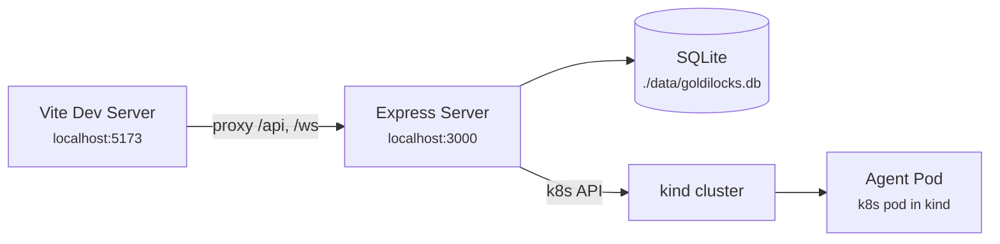

# Deployment

## Architecture

**Kubernetes is the only way to run agent sessions.** Local dev uses `kind`
(Kubernetes IN Docker), production uses a real k8s cluster. Same code, same
manifests, same behaviour.

## Development (Local with kind)



```bash
npm install
npm run k8s:setup   # one-time: create kind cluster, build agent image, apply manifests
npm run dev          # starts both concurrently
```

Vite proxies `/api` and `/ws` to port 3000 (configured in `frontend/vite.config.ts`).
Both servers hot-reload on file changes. Agent sessions run in k8s pods inside
the kind cluster. Express connects to agent pods via the k8s PortForward API.

### Daily Workflow

```bash
npm run dev                       # Start web app (agents in kind)
npm run k8s:build-agent           # Rebuild + reload agent image
kubectl get pods -n goldilocks    # Check agent pods
npm run k8s:teardown              # Delete kind cluster
```

### Dev Scripts

| Script | File | Purpose |
|--------|------|---------||
| `npm run k8s:setup` | `deploy/setup-dev.sh` | Creates kind cluster, builds agent image, loads it into kind, applies base k8s manifests |
| `npm run k8s:teardown` | `deploy/teardown-dev.sh` | Deletes the kind cluster and all its contents |
| `npm run k8s:build-agent` | (inline in `package.json`) | Rebuilds agent Docker image and reloads it into kind |

Prerequisites for local dev: `docker`, `kind`, `kubectl`.

The kind cluster is configured via `deploy/kind-config.yaml` (single control-plane
node with port 30000 mapped to host port 3000).

## Kubernetes (Production)


### Three-Tier Architecture

| Component | Type | Persistence | Isolation | Access |
|-----------|------|-------------|-----------|--------|
| **Web App** | Deployment | Yes (PVC for SQLite + workspaces) | — | Serves UI, auth, API, manages agent lifecycle |
| **Agent** | Ephemeral Pod | Yes (per-user PVC) | Full (per-user) | Only MCP server (network policy) |
| **MCP Server** | Deployment | Yes (model cache) | — | ML models, HPC job submission via SSH |

### Kubernetes Manifests

All in `k8s/` (top-level, promoted from `deploy/k8s/`):

| Manifest | Purpose |
|----------|---------|
| `namespace.yaml` | `goldilocks` namespace |
| `rbac.yaml` | ServiceAccount with pod create/delete/portforward + PVC permissions |
| `network-policies.yaml` | Agent pods can only reach MCP server (egress restricted) |
| `resource-quota.yaml` | Limits total agent pods per namespace |
| `web-app.yaml` | Web app Deployment + Service + PVC |
| `mcp-server.yaml` | MCP server Deployment + Service |
| `agent-pod-template.yaml` | Reference spec for ephemeral agent pods |
| `workspace-pvc-template.yaml` | Per-user workspace PVC template |
| `ingress.yaml` | Ingress with TLS |
| `secrets.yaml` | Secret templates for JWT_SECRET, ENCRYPTION_KEY, API keys |

### Container Images

Built from Dockerfiles in `deploy/docker/`:

| Image | Dockerfile | Contents |
|-------|-----------|----------|
| `goldilocks-web` | `deploy/docker/Dockerfile.web` | Express + built React + SQLite |
| `goldilocks-agent` | `deploy/docker/Dockerfile.agent` | Minimal Pi SDK + MCP client, runs with `agent-entrypoint.sh` |
| `goldilocks-mcp` | `deploy/docker/Dockerfile.mcp` | Python MCP server, ML models, HPC SSH client |

## Environment Variables

See the full table in the [README](../../README.md#environment-variables).

Critical production-only requirements:
- `JWT_SECRET` — **must** be set (server throws on start if missing in production)
- `ENCRYPTION_KEY` — **must** be set (same)
- `AGENT_IMAGE` — container image for agent pods
- `K8S_NAMESPACE` — namespace for agent pods (default: `goldilocks`)
- `CORS_ORIGIN` — restrict to your domain

## Graceful Shutdown

`server/src/index.ts` handles `SIGINT` and `SIGTERM`:

```ts
function shutdown() {
  sessionCache.shutdown();  // Delete all agent pods
  closeDb();                // Close SQLite connection
  server.close();           // Stop accepting new connections
}
```

The `ContainerSessionBackend.shutdown()` deletes all running agent pods
and clears the idle check interval.
