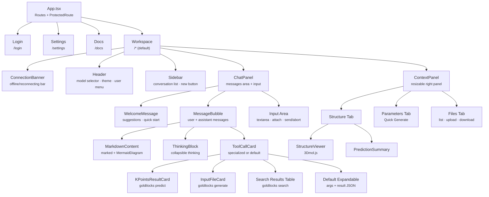
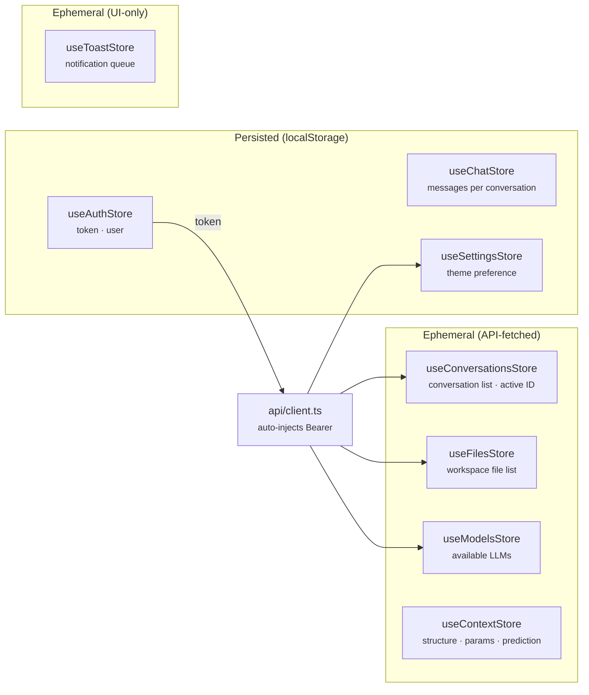
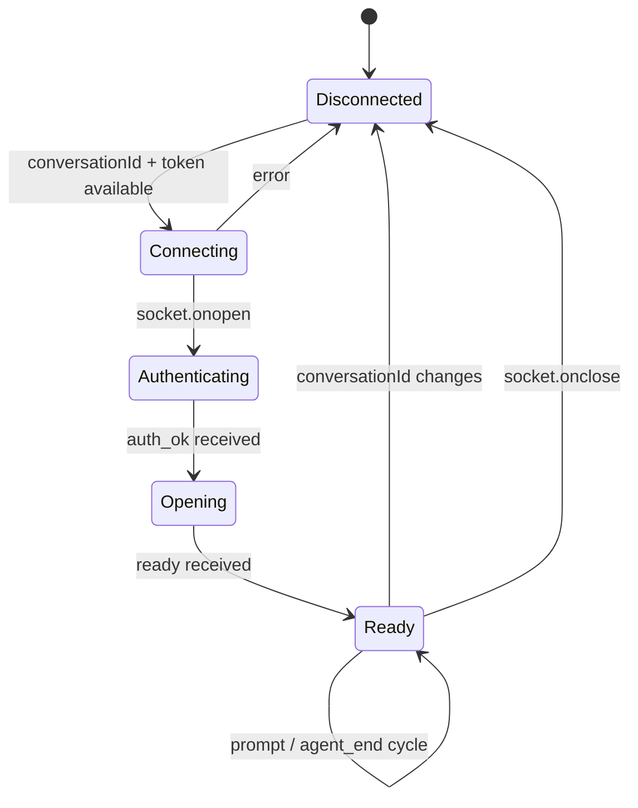

# Frontend Architecture

React 19 + Vite 6 + Tailwind CSS 4 + Zustand 5 + React Router 7.

Source: `frontend/src/`.

## Component Tree



### Component Locations

| Component | File | Renders |
|-----------|------|---------|
| `App` | `App.tsx` | React Router routes, ProtectedRoute guard |
| `Workspace` | `pages/Workspace.tsx` | Three-panel layout, responsive breakpoints, ResizableContextPanel |
| `Header` | `components/layout/Header.tsx` | Model selector dropdown, theme toggle, user menu, sidebar/context toggles |
| `Sidebar` | `components/layout/Sidebar.tsx` | Conversation list, new conversation button, delete |
| `ChatPanel` | `components/layout/ChatPanel.tsx` | Message scroll area, streaming indicator, input area with file attach |
| `ContextPanel` | `components/layout/ContextPanel.tsx` | Tab bar (Structure/Parameters/Files), 3D viewer, quick generate, file list |
| `WelcomeMessage` | `components/chat/WelcomeMessage.tsx` | Animated welcome with quick-start card and suggestion pills |
| `MessageBubble` | `components/chat/MessageBubble.tsx` | User bubble (right-aligned) or assistant bubble (avatar + blocks) |
| `ToolCallCard` | `components/chat/ToolCallCard.tsx` | Dispatches to specialized cards or shows default expandable card |
| `MarkdownContent` | `components/chat/MarkdownContent.tsx` | Parses markdown via `marked`, extracts mermaid blocks into `MermaidDiagram` components |
| `ThinkingBlock` | `components/chat/MessageBubble.tsx` | Collapsible thinking content |
| `StructureViewer` | `components/science/StructureViewer.tsx` | 3Dmol.js viewer with rendering mode selector |
| `KPointsResultCard` | `components/science/KPointsResultCard.tsx` | K-point prediction results with confidence interval visualization |
| `InputFileCard` | `components/science/InputFileCard.tsx` | Generated QE input with syntax highlighting, copy, download |

## State Management (Zustand)



### Store Details

| Store | File | Persistence | Key State |
|-------|------|-------------|-----------|
| `useAuthStore` | `store/auth.ts` | `persist` (token only) | `user`, `token`, `isAuthenticated`, `login()`, `register()`, `logout()` |
| `useChatStore` | `store/chat.ts` | Manual localStorage | `messages[]`, `isStreaming`, `currentText`, `currentThinking`, `activeTools` Map, `loadConversation()`, `endMessage()`, `endAgent()` |
| `useConversationsStore` | `store/conversations.ts` | None | `conversations[]`, `activeConversationId`, `fetch()`, `create()`, `delete()` |
| `useContextStore` | `store/context.ts` | None | `structure`, `prediction`, `functional`, `pseudoMode`, `mlModel`, `confidence` |
| `useFilesStore` | `store/files.ts` | None | `files[]`, `fetch(conversationId)` |
| `useModelsStore` | `store/models.ts` | None | `models[]`, `selectedModel`, `fetch()` |
| `useSettingsStore` | `store/settings.ts` | `persist` (theme) | `theme`, `apiKeys[]`, `fetchApiKeys()` |
| `useToastStore` | `store/toast.ts` | None | `toasts[]`, `add(type, message)` — max 3, auto-dismiss 5s |

### Chat Store Persistence Detail

`useChatStore` uses manual localStorage (not zustand `persist`) because it
needs to key messages by conversation ID:

```ts
// Storage key: 'goldilocks-chat-history'
// Shape: Record<conversationId, ChatMessage[]>

// On loadConversation(id): saves current, loads target from localStorage
// On endMessage() / addUserMessage(): persists immediately
// Tool results > 2KB are truncated before storage
// Max 50 conversations stored; oldest pruned on save
```

## Hooks

### `useAgent(conversationId)` — `hooks/useAgent.ts`

Manages the WebSocket lifecycle for a conversation. Returns `{ send, abort, isConnected, isReady, error }`.



**Generation counter:** A `generationRef` counter increments each time
`conversationId` changes. Incoming messages check `generation === generationRef.current`
before dispatching to the store. This prevents stale events from a previous
conversation's WebSocket from corrupting the current conversation's state.

### `useConnectionStatus()` — `hooks/useConnectionStatus.ts`

Polls `GET /api/health` every 30 seconds. Exponential backoff on failure.
Listens for browser `online`/`offline` events. Powers the `ConnectionBanner`
component that shows a yellow/red bar when the server is unreachable.

## API Client — `api/client.ts`

Thin wrapper around `fetch` that:
1. Reads `useAuthStore.getState().token` and injects `Authorization: Bearer` header
2. Always sends/receives JSON
3. Throws `ApiError(message, status, data)` on non-2xx responses

```ts
import { api } from '../api/client';
const data = await api.get<{ models: Model[] }>('/models');
const conv = await api.post<{ conversation: Conversation }>('/conversations', { title });
```
