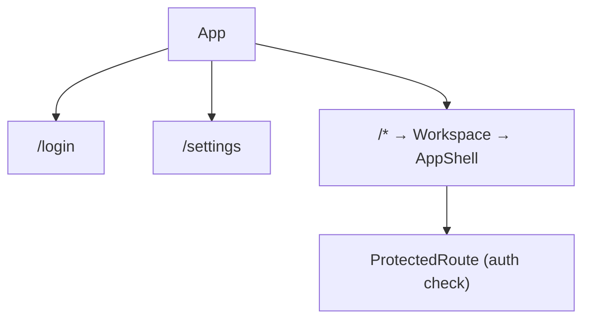

# Frontend Architecture

## Overview

React SPA with Zustand for state management. Connects to the server via WebSocket for streaming chat and REST for metadata. Vite for development with HMR.

## Layout

The app uses a **tabbed shell** with a collapsible sidebar. There is no fixed three-panel layout — the active tab determines what renders in the center content area.

```
┌──────────────────────────────────────────────────────────┐
│ Header: Model selector | Theme toggle | User menu        │
├──────────┬───────────────────────────────────────────────┤
│ Sidebar  │ TabStrip: [Conv 1] [Conv 2] [File: foo.cif]  │
│          ├───────────────────────────────────────────────┤
│ Conver-  │ TabContentHost                               │
│ sations  │                                             │
│ list     │  ConversationView  ← ChatPanel (messages)    │
│          │  FileView           ← FileBrowser + FileViewer│
│ Worksp.  │  StructureView      ← 3Dmol viewer            │
│ tree     │  WelcomeView       ← Empty state             │
│          │                                             │
└──────────┴───────────────────────────────────────────────┘
```

The sidebar switches between **Conversations** (conversation list) and **Workspace** (file tree) modes. The center pane is driven by the active tab, not a fixed panel layout.

**Shell components:**

| Component | Role |
|-----------|------|
| `AppShell` | Root layout: sidebar + center + mobile overlay logic |
| `SidebarHost` | Swaps between conversation and workspace sidebar content |
| `TabStrip` | Horizontal tab bar showing all open tabs |
| `TabContentHost` | Renders the active tab's content |
| `Header` | Model selector, theme toggle, sidebar toggle, user menu |
| `ConnectionBanner` | Full-width banner when WebSocket is disconnected |

## Routing



- `/login` — Login page (public)
- `/settings` — Settings page (lazy-loaded, protected)
- `/*` → `Workspace` → `AppShell` — Main app shell (protected)

Settings is wrapped in `React.lazy` + `Suspense` to reduce the initial bundle. All workspace viewers (Monaco, Milkdown, PDF, image) are similarly lazy-loaded from `FileViewer`.

## State Management (Zustand)

There are 10 stores. Stores marked **persisted** survive page refreshes (via `persist` middleware to localStorage).

| Store | Persistence | Holds |
|-------|-------------|-------|
| `auth` | localStorage (token) | User, JWT token, login/logout/register |
| `settings` | localStorage (theme, workspaceViewer) | Theme, defaultModel, defaultFunctional, API key metadata |
| `chat` | None | Messages, streaming deltas, active tool calls, current conversation ID |
| `chatPrompt` | None | Pending prompt queue for seeded conversations |
| `conversations` | None (API) | Conversation list, active conversation ID |
| `tabs` | Cleared on logout | Open tabs, active tab ID |
| `files` | None (API) | Workspace file tree (`tree: FileEntry[]`) and flat index |
| `models` | None (API) | Available LLM models, selected model |
| `context` | localStorage (generationDefaults) | ML prediction result, DFT parameters |
| `toast` | None | Notification queue |

### Auth transitions

All user-scoped frontend state resets on logout/login/account switch via `resetUserScopedFrontendState()` (in `session-reset.ts`). This clears: chat messages, pending prompts, conversation list, open tabs, workspace files, ML prediction. It does **not** clear: `generationDefaults` (browser-local scientific preferences), theme, workspace viewer preferences.

### Settings bootstrap sequencing

`Header` sequences startup explicitly:

1. `fetchSettings()` → await → store populated
2. `fetchModels()` + `fetchApiKeys()` → both fire only after settings are confirmed loaded

This prevents `useModelsStore` from reading a null `defaultModel` before settings have arrived.

## File-Kind Resolution

All file type classification lives in `frontend/src/lib/fileKinds.ts` — a single source of truth for viewer selection, icon mapping, and Monaco language configuration. Consumed by `FileViewer` (which viewer to load), `FileBrowser` (tree icon), and `MonacoEditor` (language).

```ts
resolveFileKind(path, monacoExtensions, imageExtensions): ResolvedFileKind
getFileIconKind(name, isDir): FileIconKind
getMonacoLanguage(path): string
isStructurePath(path): boolean
```

Structured extension sets eliminate scattered extension checks across multiple components. User-configured extension lists are passed as arguments and computed inline per call.

## Key Components

### ChatPanel

Renders the message list and input area. During streaming, shows:
- Thinking block (collapsible)
- Text content (Markdown rendered via `marked`)
- Tool call cards with live streaming content
- Welcome message when conversation is empty

### FileViewer

Handles viewing and editing workspace files. Determines viewer type from `resolveFileKind()`, lazy-loads the appropriate viewer component. Supports Markdown (Milkdown), code (Monaco), structure (3Dmol), PDF, image, and binary.

Editable files (Markdown, Monaco) show an edit/view toggle and a Ctrl+S save shortcut.

### FileBrowser

Displays the workspace file tree from `useFilesStore.tree`. Triggers initial fetch on mount if the store is empty. Search uses a direct API call with a 300ms debounce — search results replace the tree display until cleared.

### StructureViewer

3Dmol.js crystal structure viewer. Used both in the main workspace (for CIF/structure files) and in `PredictionSummary` (for predicted structures from ML k-point generation).

### MessageBubble

Renders a single message. Differentiates user messages (right-aligned, slate) from assistant messages (left-aligned, styled per content type). Handles Markdown content and tool call sections.

### ToolCallCard

Renders a single tool call during execution. Parses streaming JSON arguments to extract readable content. Shows result text or JSON after execution.

### ErrorBoundary

Top-level error boundary wrapping the entire app. Catches render errors and shows a clean error state without crashing the page.

## API Client

`frontend/src/api/client.ts` — thin typed wrapper around `fetch`. Auto-injects the Bearer token from `useAuthStore`. All endpoints return typed responses. Key exports:

- Auth: `login`, `register`, `fetchProfile`
- Conversations: `fetchConversations`, `createConversation`, `renameConversation`, `deleteConversation`, `fetchMessages`
- Files: `fetchFiles`, `fetchFile`, `putFile`, `deleteFile`, `moveFile`, `mkdir`, `uploadFile`, `downloadWorkspaceFile`
- Models: `fetchModels`, `selectModel`
- Settings: `fetchSettings`, `updateSettings`, `fetchApiKeys`, `storeApiKey`, `deleteApiKey`
- Structures: `fetchStructures`, `saveStructure`, `searchStructures`
- QuickGen: `predict`, `generate`

## Shared Types

`shared/types.ts` — WebSocket message types used by both frontend (`useAgent.ts`) and server (`websocket.ts`). Zero runtime overhead — TypeScript only.

```ts
ClientMessage:  auth | open | prompt | abort
ServerMessage:  auth_ok | auth_fail | ready | text_delta | thinking_delta |
               tool_start | tool_update | tool_end | message_end | agent_end | error
```
