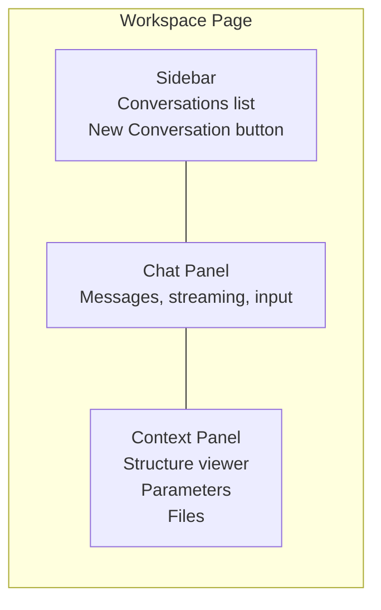
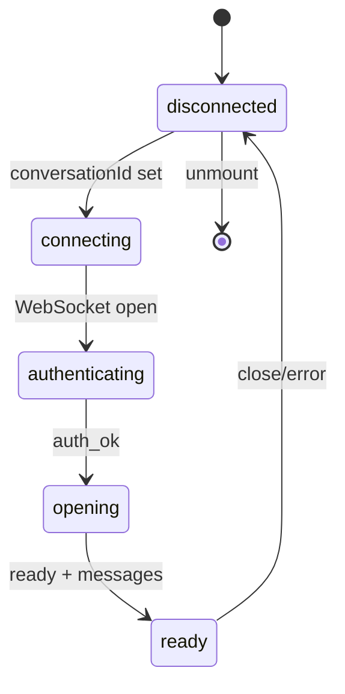

# Frontend Architecture

## Overview

React SPA with Zustand for state management. Connects to the server via WebSocket for streaming chat and REST for metadata. Vite for development with HMR.

## Layout

Three-panel layout: sidebar (conversations), chat (messages + input), context panel (structure viewer, parameters, files). All panels are resizable and collapse on mobile.

## State Management (Zustand)

| Store | Purpose |
|-------|---------|
| `auth` | User session, JWT token, login/logout |
| `chat` | Messages, streaming state, tool calls |
| `conversations` | Conversation list, active selection |
| `files` | Workspace file listing |
| `models` | Available models, selected model |
| `settings` | Theme, API key metadata |
| `context` | Prediction results (from tool calls) |
| `toast` | Toast notification queue |

### Chat Store

The chat store manages the current conversation's messages and streaming state:

- `messages`: Array of completed `ChatMessage` objects (user or assistant)
- `isStreaming`: Whether the agent is currently responding
- `currentText` / `currentThinking`: Accumulated text/thinking deltas during streaming
- `activeTools`: Map of tool calls currently in progress (with live `streamContent`)

Messages are **not persisted locally**. On conversation switch, the store is cleared and repopulated from pi's session history via the `ready` WebSocket message.

## Connection Hook (`useAgent`)

The `useAgent(conversationId)` hook manages the WebSocket connection lifecycle:

The hook exposes:
- `status`: Current connection state
- `isReady`: Whether prompts can be sent
- `send(text)`: Send a prompt
- `abort()`: Cancel current operation
- `error`: Last error message

## Key Components

### ChatPanel

Renders the message list and input area. During streaming, shows:
- Thinking block (collapsible)
- Text content (Markdown rendered)
- Tool call cards (live streaming content)
- Loading spinner when no content yet

### ToolCallCard

Renders a single tool call. Parses streaming JSON arguments to extract readable content:
- **Write tool**: Shows file path in header, file content streaming live
- **Bash tool**: Shows command in header
- **Read tool**: Shows file path in header
- **After execution**: Shows the result text

### ContextPanel

Three tabs:
- **Structure**: 3Dmol.js crystal structure viewer. Loads CIF files from workspace.
- **Parameters**: DFT calculation settings (functional, pseudopotential mode).
- **Files**: Workspace file browser with drag-and-drop upload.

### Header

Model selector dropdown (populated from pi via `get_available_models` RPC), theme toggle, user menu with settings and logout.
