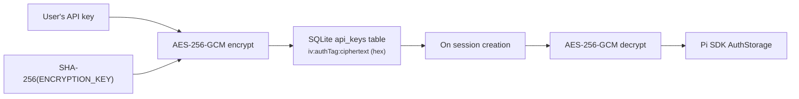
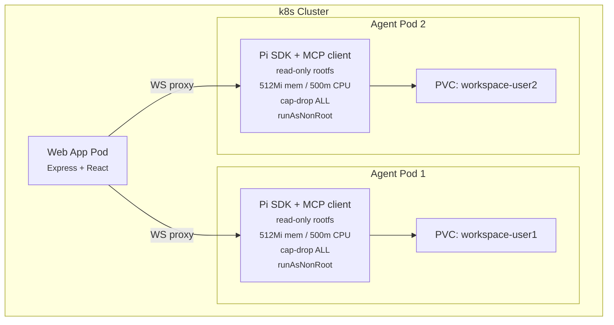

# Security Model

## Authentication & Authorization

```mermaid
graph LR
    Login["POST /api/auth/login"]
    Bcrypt["bcrypt.compare()"]
    JWT["jwt.sign()<br/><small>{ id, email }</small>"]
    Token["JWT Token<br/><small>7-day expiry</small>"]
    Client["Client stores in<br/><small>localStorage via zustand/persist</small>"]
    Request["Subsequent requests"]
    Verify["verifyToken middleware<br/><small>jwt.verify()</small>"]
    Handler["Route handler<br/><small>req.user.id available</small>"]

    Login --> Bcrypt --> JWT --> Token --> Client
    Client --> Request -->|"Authorization: Bearer"| Verify --> Handler
```



- **Password hashing:** bcrypt with 12 salt rounds (`auth/hash.ts`)
- **JWT tokens:** Signed with `JWT_SECRET`, 7-day expiry, payload is `{ id, email }`
- **Token refresh:** `POST /api/auth/refresh` issues a new token from the existing one
- **Per-user data isolation:** All database queries filter by `req.user.id`.
  Agent pods are per-user with workspace PVCs.

## API Key Encryption

User-provided LLM API keys are encrypted before storage:



Implementation in `server/src/crypto.ts`:
- Key derived from `ENCRYPTION_KEY` env var via `SHA-256`
- Random 16-byte IV per encryption
- Stored as `hex(iv):hex(authTag):hex(ciphertext)`
- Decrypted and passed to agent pods as environment variables

## Path Traversal Prevention

`server/src/agent/workspace-guard.ts` validates file paths:

```ts
function validateWorkspacePath(basePath: string, requestedPath: string): string {
  const resolved = resolve(basePath, requestedPath);
  if (!resolved.startsWith(basePath)) {
    throw new Error('Path traversal detected');
  }
  return resolved;
}
```

File names are sanitized on upload:
```ts
const safeName = basename(filename).replace(/[^a-zA-Z0-9._-]/g, '_');
```

Used in `files/routes.ts`, `quickgen/routes.ts`, and `structures/routes.ts`.

## Rate Limiting

Applied in `server/src/index.ts` via `express-rate-limit`:

| Scope | Window | Max Requests |
|-------|--------|-------------|
| Global (`/api/*`) | 1 minute | 60 (prod) / 300 (dev) |
| Auth (`/api/auth/*`) | 15 minutes | 20 |

## Agent Pod Sandboxing

Every agent session runs in its own k8s pod with full isolation:



### Pod Security

| Setting | Value | Purpose |
|---------|-------|---------|
| `runAsNonRoot` | `true` | No root processes |
| `runAsUser` | `1000` | Unprivileged user |
| `readOnlyRootFilesystem` | `true` | Immutable container |
| `allowPrivilegeEscalation` | `false` | No setuid/setgid |
| `capabilities.drop` | `["ALL"]` | No Linux capabilities |
| `automountServiceAccountToken` | `false` | No k8s API access |

### Network Isolation

NetworkPolicy restricts agent pod traffic:
- **Ingress:** Only from web-app pods (port 8080)
- **Egress:** Only DNS (kube-dns) + MCP server (port 3100) + web app (port 3000)
- **No internet access** for agent pods

### Resource Limits

Per-pod: 500m CPU, 512Mi memory, 256Mi scratch tmpfs
Per-namespace: 50 pods, 12 CPU requests, 12Gi memory requests (ResourceQuota)

## Known Limitations

1. **Workspace guard is convention-based.** `resolve()` + `startsWith()` catches
   `../` traversal but doesn't prevent symlink escapes. Agent pods provide real
   filesystem isolation via k8s.

2. **CORS is permissive in development.** `cors()` with no options allows all
   origins. Production restricts to `CORS_ORIGIN` env var.

3. **No CSRF protection.** The API relies entirely on Bearer tokens. Fine for
   API-only clients, but could be a concern if cookies are ever added.

4. **Chat history is client-side only.** Messages in `localStorage` are not
   synced to the server. Clearing browser data loses history. The `conversations`
   table stores metadata only.

5. **JWT tokens have no revocation.** Tokens are valid for 7 days. There's no
   server-side revocation list. Logout only clears the client-side token.
