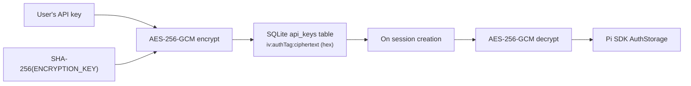
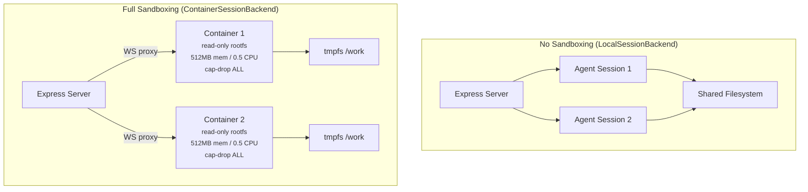

# Security Model

## Authentication & Authorization

```mermaid
graph LR
    Login["POST /api/auth/login"]
    Bcrypt["bcrypt.compare()"]
    JWT["jwt.sign()<br/><small>{ id, email }</small>"]
    Token["JWT Token<br/><small>7-day expiry</small>"]
    Client["Client stores in<br/><small>localStorage via zustand/persist</small>"]
    Request["Subsequent requests"]
    Verify["verifyToken middleware<br/><small>jwt.verify()</small>"]
    Handler["Route handler<br/><small>req.user.id available</small>"]

    Login --> Bcrypt --> JWT --> Token --> Client
    Client --> Request -->|"Authorization: Bearer"| Verify --> Handler
```



- **Password hashing:** bcrypt with 12 salt rounds (`auth/hash.ts`)
- **JWT tokens:** Signed with `JWT_SECRET`, 7-day expiry, payload is `{ id, email }`
- **Token refresh:** `POST /api/auth/refresh` issues a new token from the existing one
- **Per-user data isolation:** All database queries filter by `req.user.id`.
  File paths are scoped to `WORKSPACE_ROOT/<userId>/<conversationId>/workspace/`

## API Key Encryption

User-provided LLM API keys are encrypted before storage:



Implementation in `server/src/crypto.ts`:
- Key derived from `ENCRYPTION_KEY` env var via `SHA-256`
- Random 16-byte IV per encryption
- Stored as `hex(iv):hex(authTag):hex(ciphertext)`
- Decrypted at session creation time in `LocalSessionBackend`

## Path Traversal Prevention

`server/src/agent/workspace-guard.ts` validates file paths:

```ts
function validateWorkspacePath(basePath: string, requestedPath: string): string {
  const resolved = resolve(basePath, requestedPath);
  if (!resolved.startsWith(basePath)) {
    throw new Error('Path traversal detected');
  }
  return resolved;
}
```

File names are sanitized on upload:
```ts
const safeName = basename(filename).replace(/[^a-zA-Z0-9._-]/g, '_');
```

Used in `files/routes.ts`, `quickgen/routes.ts`, and `structures/routes.ts`.

## Rate Limiting

Applied in `server/src/index.ts` via `express-rate-limit`:

| Scope | Window | Max Requests |
|-------|--------|-------------|
| Global (`/api/*`) | 1 minute | 60 (prod) / 300 (dev) |
| Auth (`/api/auth/*`) | 15 minutes | 20 |

## Sandboxing Boundaries



## Known Limitations

1. **LocalSessionBackend has no sandboxing.** All agent sessions run in the
   Express process. A prompt injection could access the filesystem, environment
   variables, or other users' workspaces. Acceptable for single-user dev, not
   for multi-user production.

2. **Workspace guard is convention-based.** `resolve()` + `startsWith()` catches
   `../` traversal but doesn't prevent symlink escapes. Real sandboxing requires
   ContainerSessionBackend.

3. **CORS is permissive in development.** `cors()` with no options allows all
   origins. Production restricts to `CORS_ORIGIN` env var.

4. **No CSRF protection.** The API relies entirely on Bearer tokens. Fine for
   API-only clients, but could be a concern if cookies are ever added.

5. **Chat history is client-side only.** Messages in `localStorage` are not
   synced to the server. Clearing browser data loses history. The `conversations`
   table stores metadata only.

6. **JWT tokens have no revocation.** Tokens are valid for 7 days. There's no
   server-side revocation list. Logout only clears the client-side token.
