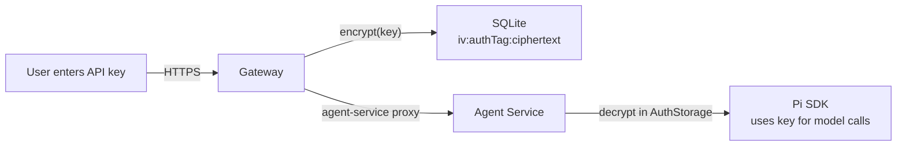

# Security

## Authentication

- **JWT tokens** with 7-day expiry. Secret must be set via `JWT_SECRET` in production.
- **bcrypt** password hashing with automatic salt.
- **Rate limiting** on auth endpoints (20 requests per 15 minutes) and API endpoints (60/min in production, 300/min in dev).

## API Key Handling

User API keys are encrypted at rest using **AES-256-GCM** and decrypted only inside the agent-service's `AuthStorage`:



- Encryption key derived from `ENCRYPTION_KEY` config via SHA-256
- Each key has a unique 16-byte IV
- Authentication tag prevents tampering
- Keys are decrypted only when the agent-service needs them for model calls
- **Keys never enter the sandbox pod environment**

## Internal Service Auth

The gateway and agent-service communicate over a shared secret:

- Gateway sends `x-goldilocks-shared-secret` header on HTTP requests
- Gateway sends `{type: "auth", gatewayToken}` on WS connections
- `CONFIG.agentServiceSharedSecret` throws in production if the env var is not set (no default fallback)
- Dev default: `dev-agent-service-secret` (only when `NODE_ENV !== production`)

## Container Isolation

Each user runs in their own k8s pod with:

| Control | Setting |
|---------|---------|
| Non-root | `runAsUser: 1000`, `runAsGroup: 1000` |
| No privilege escalation | `allowPrivilegeEscalation: false` |
| Dropped capabilities | `capabilities: { drop: ['ALL'] }` |
| Filesystem isolation | Each user's home is a separate hostPath |
| No service account | `automountServiceAccountToken: false` |
| No provider keys | API keys stay in agent-service AuthStorage |

The init container runs as root solely to `chown` the hostPath directory for uid 1000. The main container cannot escalate.

## Path Traversal Protection

File operations go through k8s exec — the web app never touches the user's filesystem directly. The exec commands use sanitised filenames:

```typescript
const safeName = filename.replace(/[^a-zA-Z0-9._-]/g, '_');
```

## Network

Currently no network policies are enforced in dev. Production should restrict agent pods to:
- DNS resolution (kube-dns)
- External HTTPS (model provider APIs)
- Nothing else (no inter-pod, no internal services)

## Secrets Management

Dev secrets are generated inline by the Tiltfile. Production secrets must be created out-of-band:

```bash
kubectl create secret generic app-secrets \
  --from-literal=jwt-secret=$(openssl rand -hex 32) \
  --from-literal=encryption-key=$(openssl rand -hex 32) \
  --from-literal=agent-service-shared-secret=$(openssl rand -hex 32) \
  -n goldilocks
```

The `agent-service-shared-secret` is required in production — the application will not start without it.