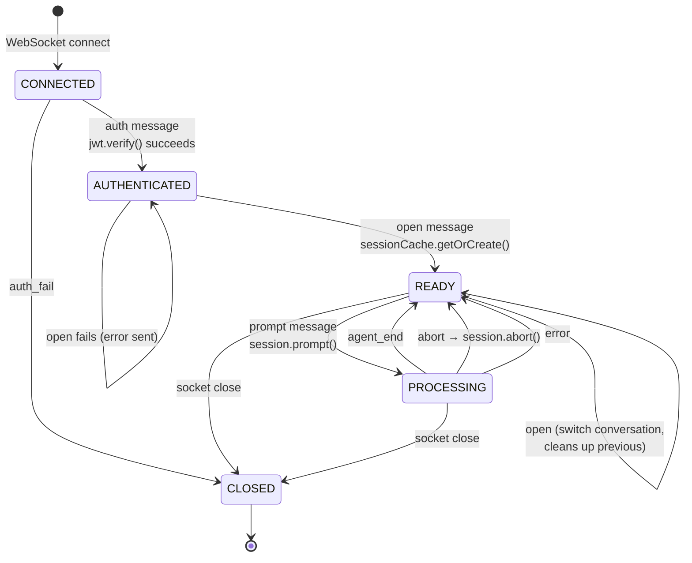
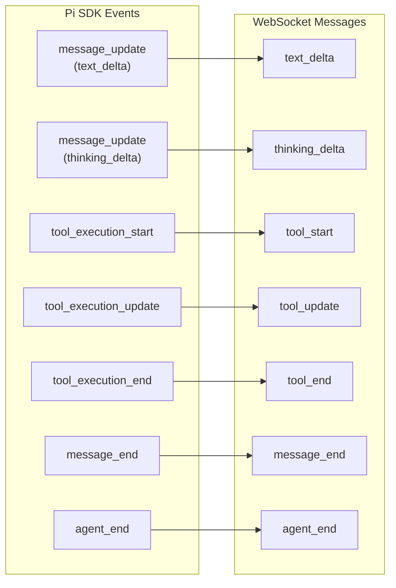
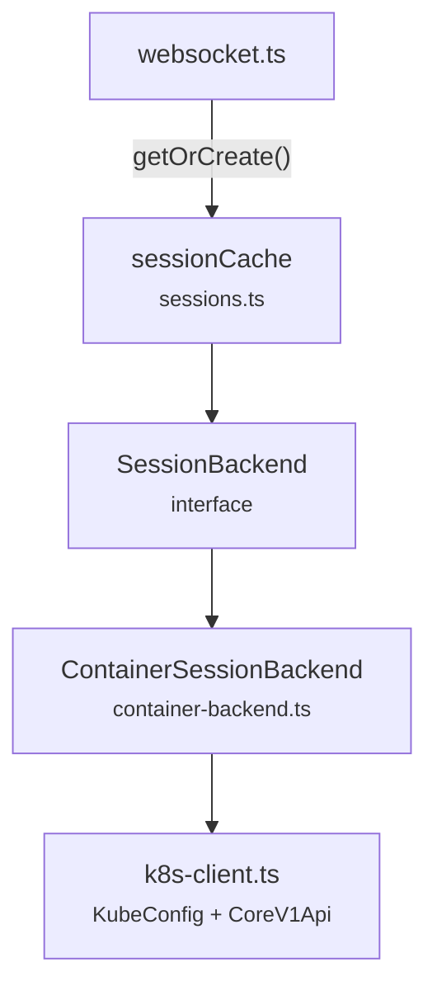
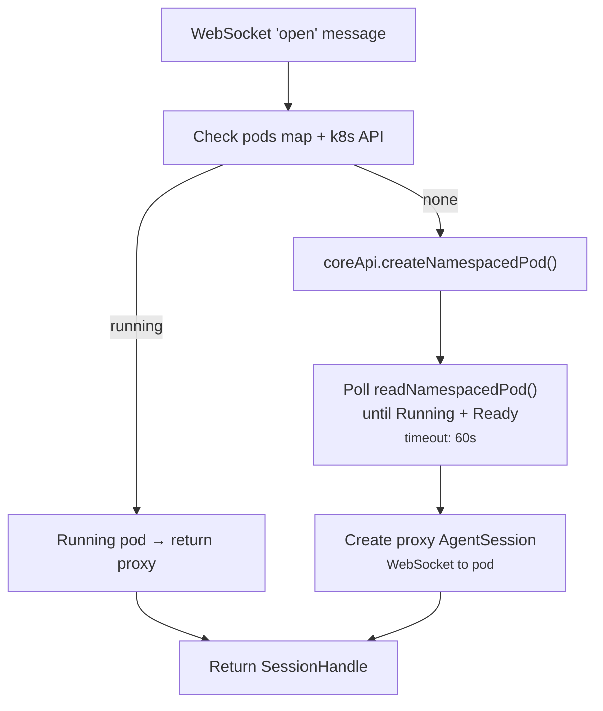

# WebSocket & Session Management

The WebSocket layer connects the frontend chat to the Pi SDK agent sessions.
This document covers the protocol state machine, event mapping, and session
backend.

## WebSocket State Machine

Each WebSocket connection tracks a `ClientState` object with authentication,
conversation binding, and processing status:



### Server-Side State

```ts
// server/src/agent/websocket.ts
interface ClientState {
  user: AuthUser | null;           // Set after auth
  conversationId: string | null;   // Set after open
  session: AgentSession | null;    // Pi SDK session (proxy to k8s pod)
  unsubscribe: (() => void) | null; // Event subscription cleanup
  isProcessing: boolean;           // Prevents concurrent prompts
}
```

## Pi SDK Event Mapping

The `mapAgentEvent()` function in `websocket.ts` translates Pi SDK event types
to the `ServerMessage` union (defined in `shared/types.ts`):



The `tool_update` message carries streaming output from tools (e.g., partial
bash stdout). Currently the frontend's `updateToolCall` store action is a no-op
placeholder, but the infrastructure is in place.

## Session Backend Interface



### Interface — `session-backend.ts`

```ts
interface SessionBackend {
  getOrCreate(userId: string, conversationId: string): Promise<SessionHandle>;
  touch(userId: string, conversationId: string): void;
  dispose(userId: string, conversationId: string): void;
  shutdown(): void;
}

interface SessionHandle {
  session: AgentSession;     // Pi SDK session object (proxy to k8s pod)
  workspacePath: string;     // /work (inside the pod)
  sessionPath: string;       // /tmp/pi-session (inside the pod)
}
```

### `sessionCache` Wrapper — `sessions.ts`

The `sessionCache` in `sessions.ts` wraps the `ContainerSessionBackend`
and provides a simplified API that returns `AgentSession` directly (the
WebSocket layer only needs the session object):

```ts
const sessionCache = {
  getOrCreate(userId, convId): Promise<AgentSession>,  // Unwraps SessionHandle
  touch(userId, convId): void,
  dispose(userId, convId): void,
  shutdown(): void,
  get backend(): SessionBackend,  // For code that needs full SessionHandle
};
```

## ContainerSessionBackend (k8s)

The only session backend. Creates a k8s pod per session using
`@kubernetes/client-node`.



### Pod Configuration

Each pod runs with strict isolation:

| Setting | Value |
|---------|-------|
| `runAsNonRoot` | `true` |
| `runAsUser` | `1000` |
| `readOnlyRootFilesystem` | `true` |
| `allowPrivilegeEscalation` | `false` |
| `capabilities.drop` | `["ALL"]` |
| Memory limit | `512Mi` |
| CPU limit | `500m` |
| Scratch tmpfs | `256Mi` (Memory-backed) |
| Workspace | PVC mount at `/work` |

### Pod Naming

`agent-{userId first 8}-{conversationId first 8}` (lowercase alphanumeric).

### WebSocket Proxy

The `ContainerSessionBackend` creates a proxy `AgentSession` that looks like
a normal session to the WebSocket handler but forwards all calls via WebSocket
to the agent pod:

- **In-cluster:** direct WebSocket to pod IP (`ws://<podIP>:8080`)
- **Out-of-cluster:** k8s PortForward API tunnel to `127.0.0.1:<localPort>`

Methods:
- `subscribe(callback)` → connects WebSocket, parses incoming JSON events
- `prompt(text)` → sends `{ type: "prompt", text }` to pod
- `abort()` → sends `{ type: "abort" }` to pod
- `dispose()` → closes WebSocket, closes port-forward tunnel

### Idle Timeout

Every 60 seconds, the backend checks all tracked pods. Any pod idle longer
than `AGENT_IDLE_TIMEOUT_MS` (default: 30 minutes) is deleted via the k8s API.
