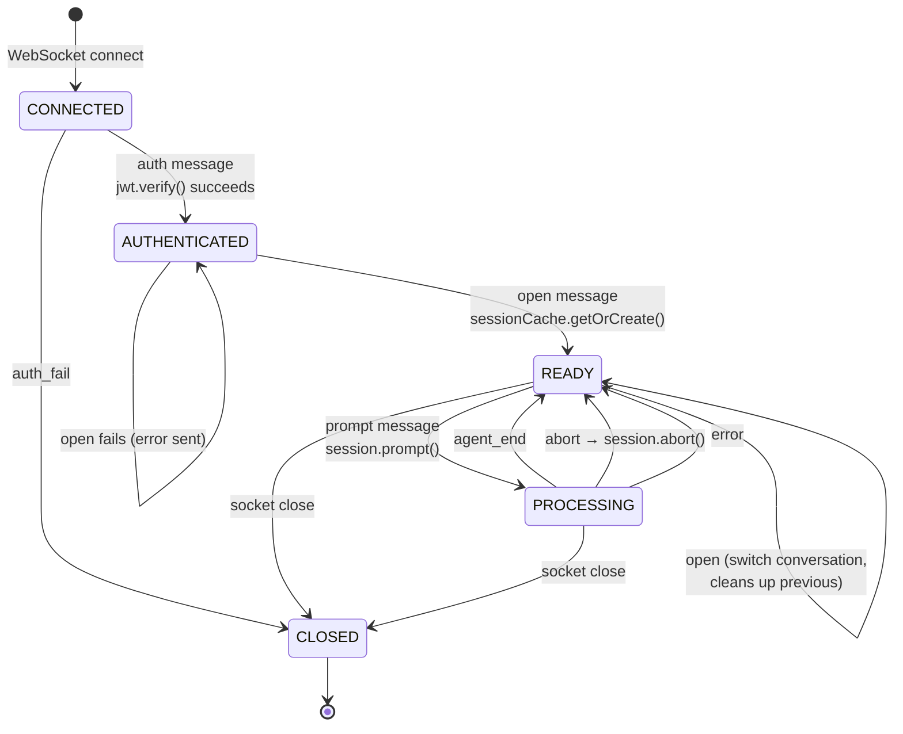
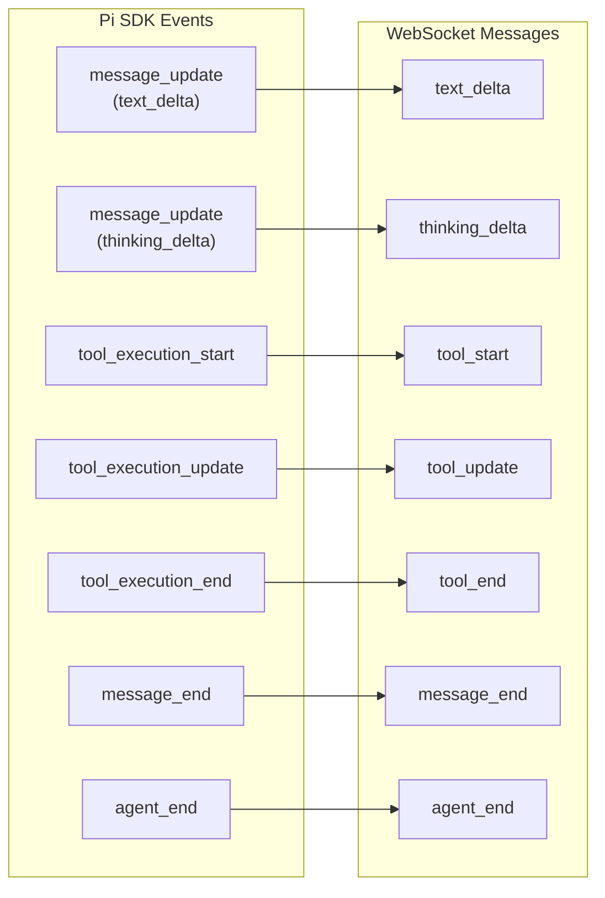
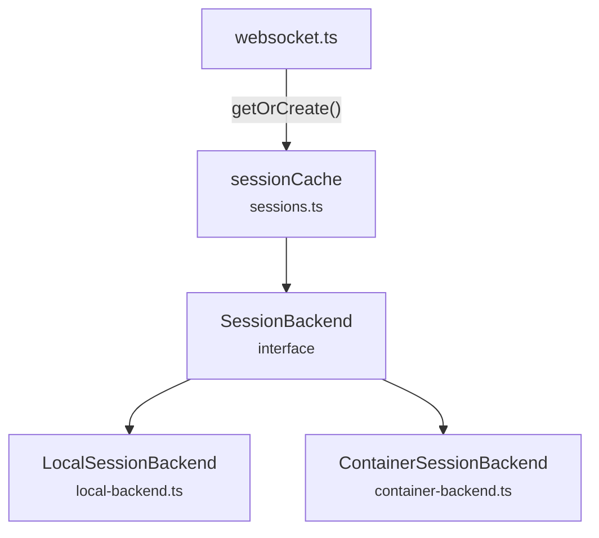
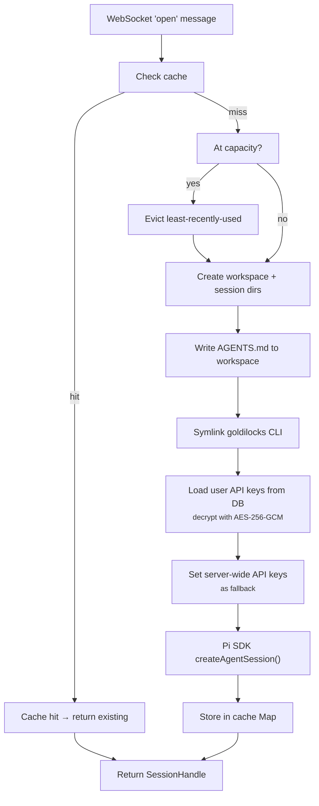
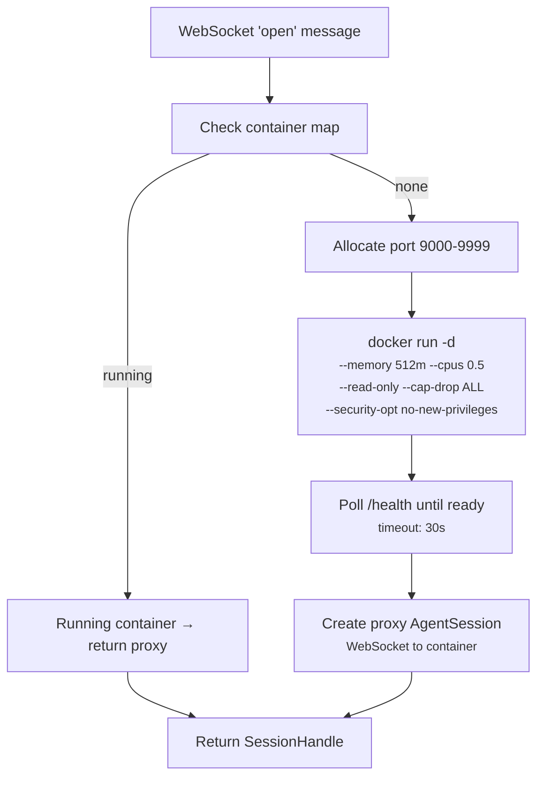

# WebSocket & Session Management

The WebSocket layer connects the frontend chat to the Pi SDK agent sessions.
This document covers the protocol state machine, event mapping, and session
backend abstraction.

## WebSocket State Machine

Each WebSocket connection tracks a `ClientState` object with authentication,
conversation binding, and processing status:



### Server-Side State

```ts
// server/src/agent/websocket.ts
interface ClientState {
  user: AuthUser | null;           // Set after auth
  conversationId: string | null;   // Set after open
  session: AgentSession | null;    // Pi SDK session
  unsubscribe: (() => void) | null; // Event subscription cleanup
  isProcessing: boolean;           // Prevents concurrent prompts
}
```

## Pi SDK Event Mapping

The `mapAgentEvent()` function in `websocket.ts` translates Pi SDK event types
to the `ServerMessage` union (defined in `shared/types.ts`):



The `tool_update` message carries streaming output from tools (e.g., partial
bash stdout). Currently the frontend's `updateToolCall` store action is a no-op
placeholder, but the infrastructure is in place.

## Session Backend Interface



### Interface — `session-backend.ts`

```ts
interface SessionBackend {
  getOrCreate(userId: string, conversationId: string): Promise<SessionHandle>;
  touch(userId: string, conversationId: string): void;
  dispose(userId: string, conversationId: string): void;
  shutdown(): void;
}

interface SessionHandle {
  session: AgentSession;     // Pi SDK session object
  workspacePath: string;     // /data/workspaces/<userId>/<convId>/workspace
  sessionPath: string;       // /data/workspaces/<userId>/<convId>/pi-session
}
```

### `sessionCache` Wrapper — `sessions.ts`

The `sessionCache` in `sessions.ts` is a thin compatibility wrapper that
selects the backend based on `SESSION_BACKEND` env var and provides a
simplified API that returns `AgentSession` directly (the WebSocket layer
only needs the session object):

```ts
const sessionCache = {
  getOrCreate(userId, convId): Promise<AgentSession>,  // Unwraps SessionHandle
  touch(userId, convId): void,
  dispose(userId, convId): void,
  shutdown(): void,
  get backend(): SessionBackend,  // For code that needs full SessionHandle
};
```

## LocalSessionBackend

Used in development and single-user deployments (`SESSION_BACKEND=local`,
the default).



### Key Details

- **Cache key:** `${userId}:${conversationId}`
- **LRU eviction:** When `sessions.size >= CONFIG.maxSessions`, the session with
  the oldest `lastActive` timestamp is disposed
- **Idle eviction:** Every 60 seconds, sessions idle longer than
  `SESSION_IDLE_TIMEOUT_MS` (default: 5 min) are disposed
- **API key priority:** User's encrypted keys from the `api_keys` table are
  decrypted and set on `AuthStorage` first. Server-wide keys from env vars
  are set as fallback.
- **Session continuity:** Uses `SessionManager.continueRecent()` to resume
  the most recent Pi session if one exists in the session directory. Falls back
  to `SessionManager.create()` for new sessions.

### ⚠️ Security Warning

All users share the same OS process. No filesystem or process isolation.
A prompt injection could access other users' data. **Use
ContainerSessionBackend for multi-user deployments.**

## ContainerSessionBackend

Used in production multi-user deployments (`SESSION_BACKEND=container`).



### Container Configuration

Each container runs with strict isolation:

| Flag | Purpose |
|------|---------|
| `--memory 512m` | Memory limit |
| `--cpus 0.5` | CPU limit |
| `--read-only` | Read-only root filesystem |
| `--tmpfs /tmp:size=256m` | Writable temp |
| `--tmpfs /work:size=1g` | Writable workspace |
| `--security-opt no-new-privileges` | No privilege escalation |
| `--cap-drop ALL` | Drop all Linux capabilities |

### Proxy Session

The `ContainerSessionBackend` creates a proxy `AgentSession` that looks like
a normal session to the WebSocket handler but forwards all calls via WebSocket
to the container:

- `subscribe(callback)` → connects a WebSocket to `ws://localhost:<port>`,
  parses incoming JSON events, forwards to callback
- `prompt(text)` → sends `{ type: "prompt", text }` to container
- `abort()` → sends `{ type: "abort" }` to container
- `dispose()` → closes WebSocket, stops container

### PodReaper — `pod-reaper.ts`

Periodic cleanup process that finds orphaned agent containers:

- Runs every 5 minutes (configurable)
- Lists all containers with the `goldilocks-agent` label
- Kills any container running longer than 4 hours
- Kills containers not tracked by the session backend
- Logs each reap operation
