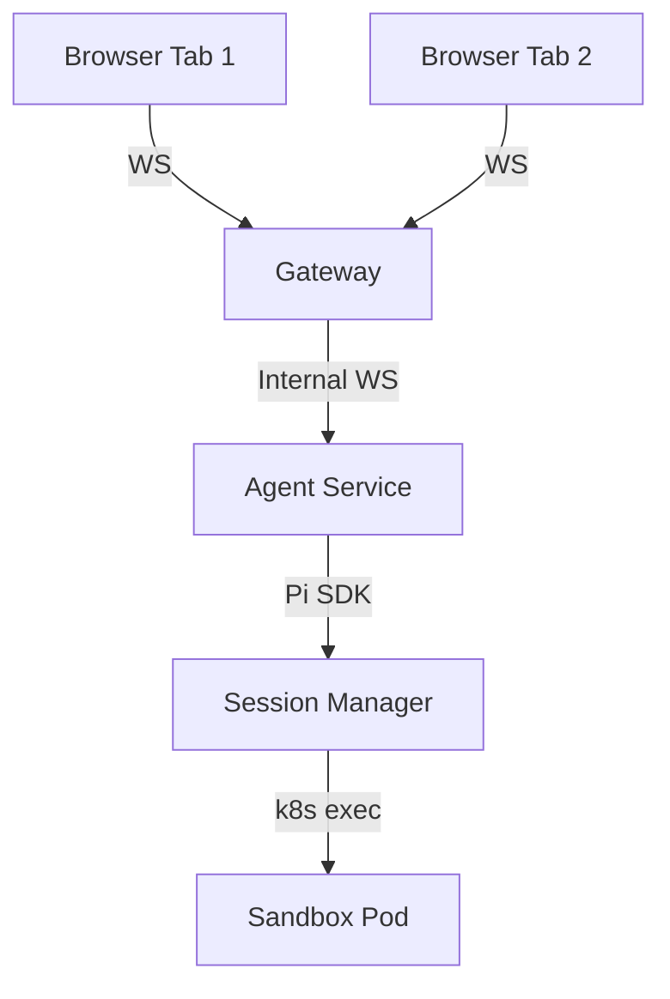
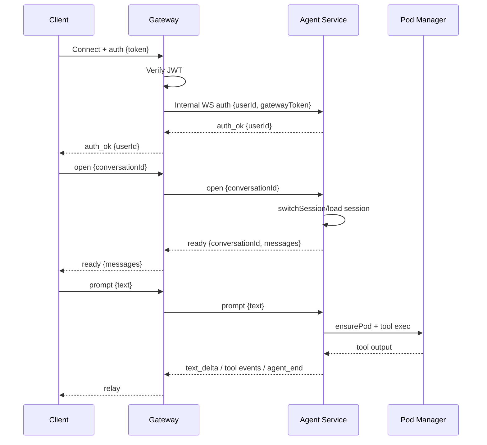
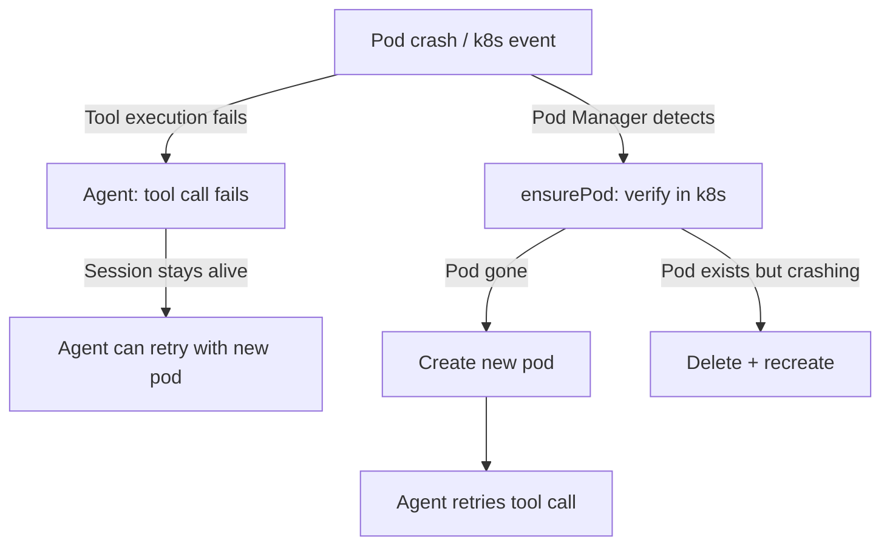

# WebSocket Sessions

## Connection Model

One WebSocket connection per browser tab. Each browser connection authenticates, then the gateway opens an internal WebSocket to the agent-service. The gateway relays messages between browser and agent-service.

## Session Lifecycle

### Connection

### Re-authentication Safety

If a browser sends a second `auth` message (e.g., on token refresh), the gateway:

1. Increments a generation counter for this browser connection
2. Closes the old agent-service WS and removes its listeners
3. Opens a new agent-service WS with the new credentials
4. All event handlers check the generation counter — stale sockets are silently ignored

This prevents orphaned sockets and cross-user event bleed.

### Keepalive

Both browser and agent-service connections use ping/pong keepalive at 30-second intervals. If no pong is received within 60 seconds, the connection is terminated. This prevents zombie connections from accumulating.

### Pod Idle Timeout

The Pod Manager checks every 60 seconds for idle pods. When evicted (30 min no activity):
- The pod is deleted (gracePeriod: 5s)
- The hostPath volume is preserved — sessions and files survive
- Next user interaction recreates the pod

### Pod Failure

Tool failures are just tool failures — the session and agent remain healthy. This is the key architectural benefit of separating the brain from the hands.

## Multi-Tab Behaviour

Each browser tab has its own gateway→agent-service WebSocket. The agent-service tracks connections per conversation key (`userId:conversationId`), so multiple tabs viewing the same conversation can coexist cleanly.

## Conversation Switching

When a user switches conversations:

1. Frontend closes the old WebSocket, opens a new one
2. Agent-service calls `switchSession` on the Pi SDK
3. Session loads from durable storage (hostPath)
4. History is fetched and sent in the `ready` message
5. Frontend renders the full conversation