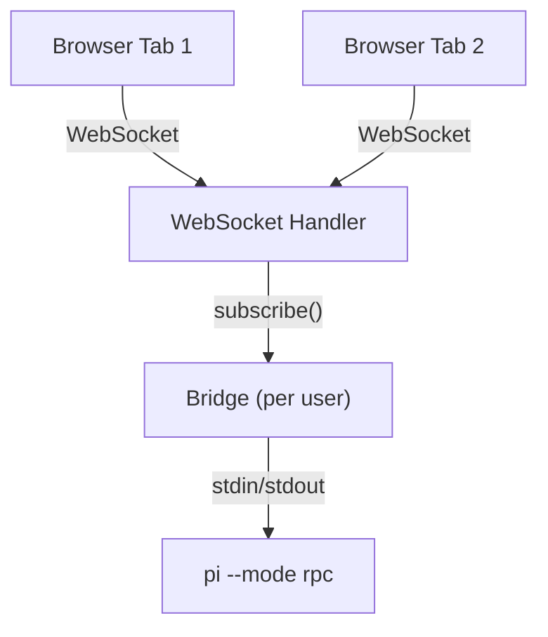
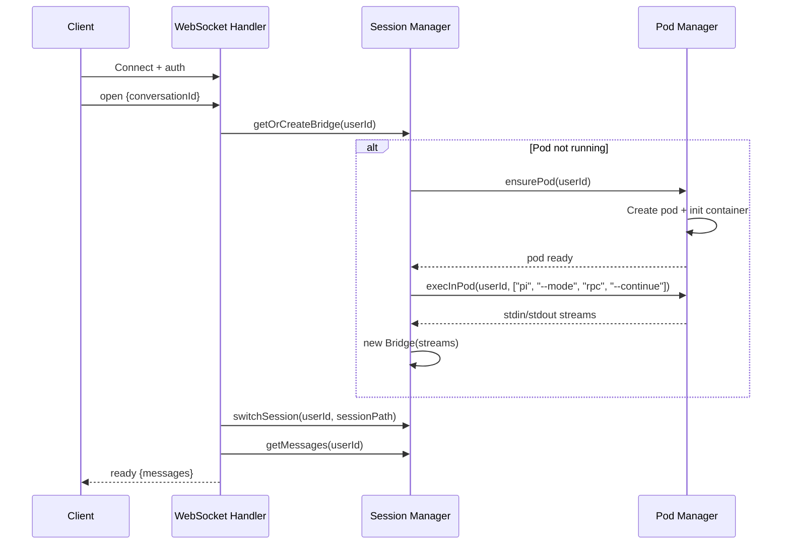
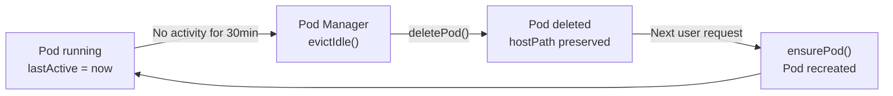
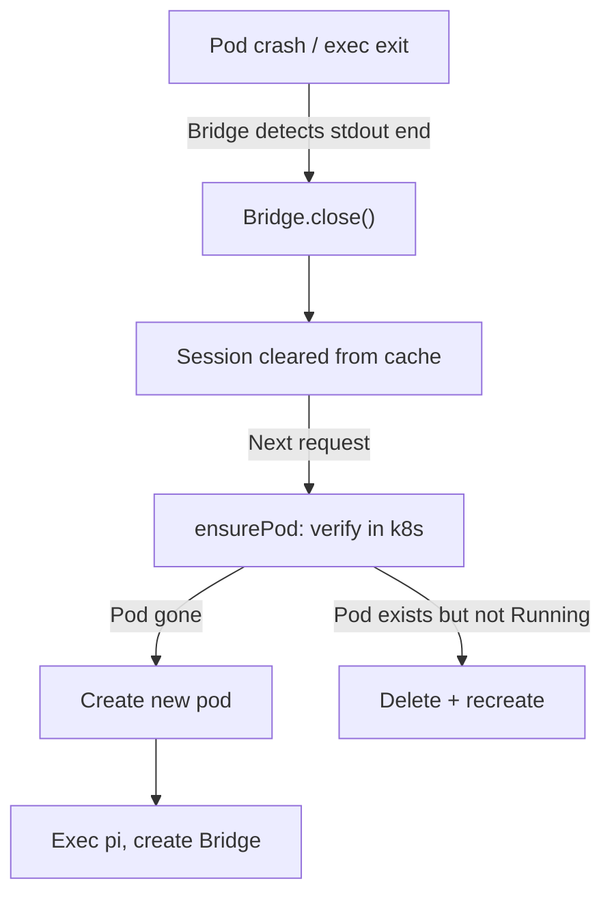

# WebSocket Sessions

## Connection Model

One WebSocket connection per browser tab. Multiple tabs for the same user share the same Bridge on the server — events fan out to all connected clients.

## Session Lifecycle

### Connection

### Idle Timeout

The Pod Manager checks every 60 seconds for idle pods. When evicted:
- The Bridge is closed (pending RPCs rejected)
- The pod is deleted (gracePeriod: 5s)
- The hostPath volume is **preserved** — sessions and files survive
- Next user interaction recreates the pod and re-execs pi

### Pod Failure

The Pod Manager verifies pod existence with the k8s API before trusting its in-memory record. If the pod was deleted externally (kubectl, Tilt restart, node crash), it detects this and recreates.

### Failure Backoff

| Attempt | Delay | Action |
|---------|-------|--------|
| 1 | Immediate | Recreate pod |
| 2 | 5 seconds | Recreate pod |
| 3+ | 30 seconds | Surface error to user, stop retrying |

The backoff counter resets when a pod successfully starts.

## Multi-Tab Behaviour

All tabs connected as the same user share one Bridge:

- Tab A sends a prompt → both Tab A and Tab B see the streaming response
- Tab B sends a prompt while Tab A's is processing → pi queues it via `followUp` behaviour
- Tab A disconnects → Tab B continues receiving events
- All tabs disconnect → Bridge stays alive until idle timeout

## Conversation Switching

When a user switches conversations:

1. Frontend closes the old WebSocket, opens a new one
2. Server sends `switch_session` RPC to pi with the session file path
3. Pi loads the session from disk
4. Server calls `get_messages` to fetch the history
5. History sent to frontend in the `ready` message
6. Frontend renders the full conversation

Pi's session files live on the hostPath at `~/.pi/agent/sessions/`. The SQLite `conversations.pi_session_id` column stores the absolute path to each session file.
